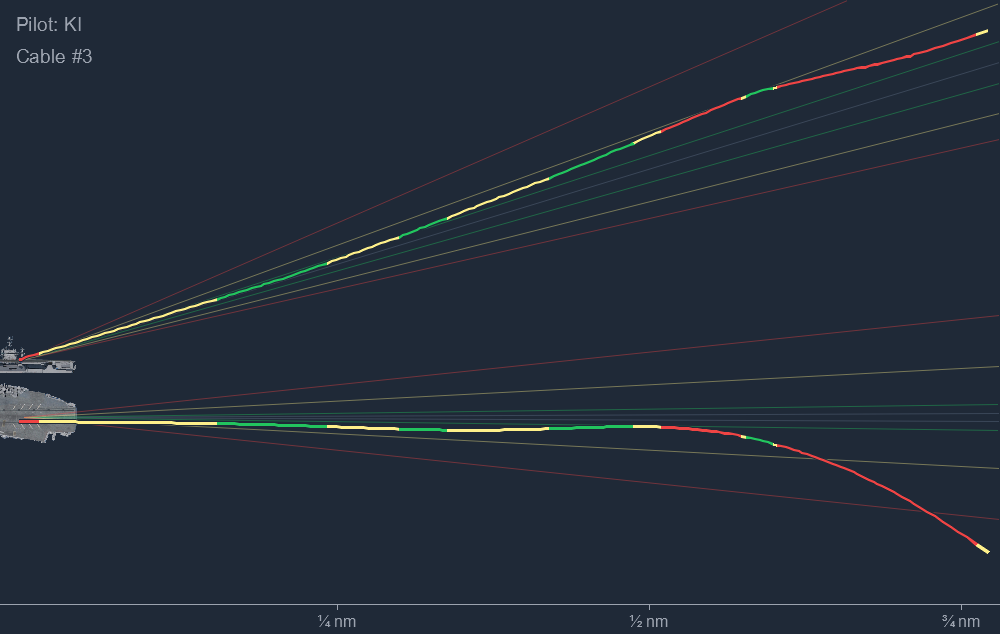

# DCS-gRPC LSO

LSO is a Rust command-line tool that monitors DCS carrier recoveries through the
[sevenfifty777 DCS-gRPC fork](https://github.com/sevenfifty777/rust-server). It records the Case I
pattern and final approach, estimates the arresting wire, applies a simplified gate-based pass
grade, produces trap-sheet images and structured output, and can publish a greenie board locally
or through Discord.



## Current capabilities

- Strict compatible-pair monitoring, including units spawned after LSO starts: AV-8B/Tarawa V/STOL
  and supported hook aircraft on arrested carriers.
- Full-pattern detection inside 3.5 nm and below 1,100 ft MSL, followed by 10 Hz recording.
- Carrier-relative final-approach and overhead-pattern PNG charts with AoA-coloured tracks.
- Bracketed/interpolated gates at 3/4, 1/2, and 1/4 nm with freshness/skew evidence. Incomplete
  observations receive `NC` and no points.
- Aircraft/carrier transforms stay on the priority loop; CATOBAR hook state is sampled independently
  at 4 Hz by default with a 300 ms timeout. Stale or unknown hook data is never reused as certainty.
- Separate outcome, grade, points, cause, confidence, completeness, rule version and wire provenance.
- Event correlation and positional completeness are independent: an event-stream outage is reported
  as `event_stream_unavailable` and cannot manufacture a positional gap or a favourable outcome.
- Per-recovery cadence/gap/source-age and paired-transform latency percentiles, plus sliding-window
  telemetry health that identifies sustained gate-capture risk.
- JSON reports, optional compressed Tacview ACMI recordings, and persistent SQLite history.
- Optional Discord reports, terminal session summary, and HTTP greenie board.
- Offline regeneration of the approach chart from ACMI files created by LSO.

The pass grade is a `PROJECT-DERIVED` training score, never an official USN/USMC certification. It
uses glideslope and lineup deviations at three gates; AoA colours the charts but does not change the grade. See
[the grading reference](docs/GRADING_REFERENCE.md) for the exact behavior.

## Requirements

- Windows or another platform supported by the Rust dependency stack.
- DCS World with the official forked
  [DCS-gRPC `v0.9.0` release](https://github.com/sevenfifty777/rust-server/releases/tag/v0.9.0).
  The committed lockfile resolves that tag to commit
  `5bd6d6e42491c8697a5c5a95e80a2e689923bd3b`.
- A Rust stable toolchain only when building from source.

The DCS-gRPC server and this client must use compatible protobuf APIs. Upstream DCS-gRPC 0.8.1 is
not supported by the current build.

## Quick start

Build LSO from the repository root:

```powershell
cargo build --release
New-Item -ItemType Directory -Force C:\LSO\recordings
.\target\release\lso.exe run -o C:\LSO\recordings
```

LSO connects to `http://127.0.0.1:50051` by default and retries transient gRPC failures with
exponential backoff. Use `--uri` when DCS-gRPC is on another host or port.

Common examples:

```powershell
# Include the persistent web board at http://localhost:8080
.\lso.exe run -o C:\LSO\recordings --web-port 8080

# Save charts and JSON, but not ACMI
.\lso.exe run -o C:\LSO\recordings --no-acmi

# A/B diagnostic: compare the independent hook sampler with the former blocking path
.\lso.exe run -o C:\LSO\recordings --hook-sampling-hz 4 --hook-timeout-ms 300
.\lso.exe run -o C:\LSO\recordings --legacy-inline-hook-sampling

# Minimal acquisition baseline: positions + JSON quality report only
.\lso.exe run -o C:\LSO\recordings --positions-only --baseline-manifest .\baseline.json

# Keep normal outputs but suspend redundant same-aircraft detector transforms during collection
.\lso.exe run -o C:\LSO\recordings --suspend-detectors-during-recovery

# Enable debug or trace logging; global flags go before the subcommand
.\lso.exe -v run -o C:\LSO\recordings
.\lso.exe -vv run -o C:\LSO\recordings

# Regenerate an approach PNG from an LSO-created ACMI file
.\lso.exe file C:\LSO\recordings\LSO-20260825-031018-Pilot.zip.acmi
```

Use `lso.exe --help` and `lso.exe run --help` for the complete generated CLI reference.
With `--no-acmi`, the TacView writer and ACMI-only metadata/unit RPCs are not started; live grading,
JSON, PNG, SQLite and health diagnostics use the same telemetry path as normal.
`--positions-only` additionally disables event/hook sampling, ACMI, SQLite, PNG, Discord and the
session/dashboard outputs. It does not read `--discord-users`, open or create `lso.db`, or query
output-only DCS metadata; it retains the JSON position report so cadence and latency percentiles can
be compared between live runs. Detector suspension is scoped by aircraft: another aircraft can still
be discovered and recorded concurrently.
Copy [`docs/BASELINE_MANIFEST.example.json`](docs/BASELINE_MANIFEST.example.json) and fill in the DCS
build, mission/module versions and deployed DLL/Lua hashes to make those comparisons attributable.
Supplied manifests reject unknown keys, empty content and malformed SHA-256 values.

## Output

A completed live pass writes or updates the following items in `--out-dir`:

| Artifact | Purpose |
|---|---|
| `LSO-<date>-<pilot>-<recovery-id>.png` | Final-approach trap sheet |
| `LSO-<date>-<pilot>-<recovery-id>-pattern.png` | Overhead pattern chart |
| `LSO-<date>-<pilot>-<recovery-id>.json` | Schema-v3 result, gates, event/time/hook/wire evidence and telemetry quality |
| `LSO-<date>-<pilot>-<recovery-id>.zip.acmi` | Compressed Tacview recording; omitted with `--no-acmi` |
| `lso.db` | Shared SQLite history; one row is inserted per saved pass |

Pilot names in filenames are reduced to ASCII alphanumeric characters. Offline `file` mode writes
only a regenerated approach PNG to the current working directory; it does not update JSON,
SQLite, Discord, or the pattern chart.

Artifact publication is create-if-absent on Windows and Unix. A completed temporary file is linked
atomically into place, so a concurrent producer cannot replace the winner; JSON ownership gates the
matching ACMI, SQLite, render and Discord work for a `recovery_id`.

Build provenance defines `lso_dirty` from tracked Git files only. Modified, staged or deleted tracked
files participate; untracked files (including `target/`) deliberately do not.

## Supported units

| Aircraft | DCS type names |
|---|---|
| F/A-18C Hornet | `FA-18C_hornet` |
| F-14A Tomcat | `F-14A-135-GR`, `F-14A-135-GR-Early`, `F-14A-95-GR` |
| F-14B Tomcat | `F-14B`, `F-14A/B` |
| F-14B(U) Tomcat | `F-14B(U)`, `F-14BU` |
| VNAO T-45C Goshawk | `T-45` |
| AV-8B NA (Tarawa only) | `AV8BNA` |

| Carrier geometry | DCS type names |
|---|---|
| Nimitz-class | `CVN_71`, `CVN_72`, `CVN_73`, `CVN_75`, `Stennis` |
| Forrestal | `Forrestal` |
| Tarawa (AV-8B only) | `LHA_Tarawa` |

Unsupported types are ignored. `Stennis` is DCS's type name for CVN-74.

## Web and Discord

`--web-port <PORT>` serves `/` and `/api/passes` on `127.0.0.1` and refreshes the browser board every
10 seconds. Phase 1 intentionally has no remote bind, OAuth2 or TLS.

Discord delivery is enabled with `--discord-webhook`. Keep webhook URLs out of source control,
screenshots, logs, and shared command transcripts. `--discord-users` accepts a JSON map from DCS
pilot names to Discord numeric user IDs; it is optional.

## Documentation

- [Installation and administration](docs/ADMIN_GUIDE.md)
- [Technical architecture](docs/LSO_ANALYSIS.md)
- [Reliability model](docs/RELIABILITY_ARCHITECTURE.md)
- [Grading behavior](docs/GRADING_REFERENCE.md)
- [Data contracts and migrations](docs/DATA_CONTRACTS.md)
- [Benchmark protocol](docs/BENCHMARK_PROTOCOL.md)
- [Live validation and version manifest](docs/LIVE_VALIDATION.md)
- [Deployment and rollback](docs/DEPLOYMENT_ROLLBACK.md)
- [DCS-gRPC fork migration](docs/DCS_GRPC_FORK_MIGRATION.md)
- [Contributing](CONTRIBUTING.md)
- [Changelog](CHANGES.md)

`docs/DCS-gRPC-0.9.0/` is a bundled upstream/fork reference snapshot and is not maintained as LSO
documentation.

## License

LSO is licensed under the [GNU Affero General Public License v3.0](LICENSE).
