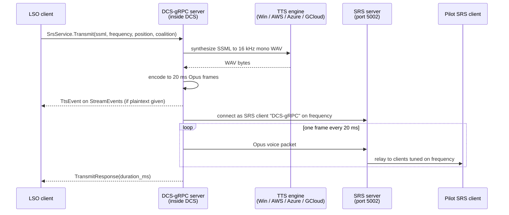
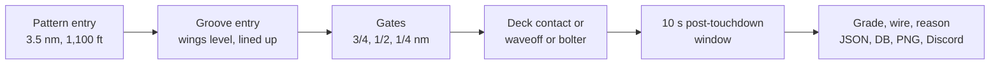

# LSO TTS Capabilities

|  |  |  |
| --- | --- | --- |
|  |  |  |
|  |  |  |

2026-09-16 · @u_goD0syBgbLDzhkPHURUjHQ

## Summary

The rust-server fork already ships a complete text-to-speech radio path: any gRPC client can send a text string to `SrsService.Transmit` and the server synthesizes it, encodes it to Opus and plays it on a chosen radio frequency through an SRS server. LSO does not use it yet. The `lso-tts` branch contains no TTS code, and the LSO source tree has no reference to the SRS service, so everything below the server section is design space, not shipped behaviour.

What is possible today without touching the server:

- LSO can speak any text on any frequency, blue or red, from a chosen map position, and know how long the audio lasts.
- Four voice engines are selectable per call: Windows built-in (free, offline), AWS Polly, Azure Speech, Google Cloud TTS.
- LSO can ask the server which players are on which SRS frequency, and can be told, through the event stream, whenever a player tunes or leaves a frequency.
- Every spoken call can carry a plain-text copy that other clients receive as a `TtsEvent` (subtitle or accessibility use).

What is not possible today: recognising the pilot's voice (SRS input is not decoded by the server), interrupting a transmission once started, and speaking from a DCS unit's own radio rather than from a synthetic SRS client.

## How a text string becomes a radio call

One unary RPC does the whole job. The caller sends text plus a frequency; the DCS-gRPC server synthesizes speech, converts it to 20 ms Opus frames, opens a throw-away SRS client on the SRS server and streams the frames at real-time pace. Pilots tuned to that frequency in their SRS client hear it like any other radio call.

Reading: the LSO never touches audio. It sends text and gets back the spoken duration in milliseconds. With `async = false` (the default) the RPC returns only after the last frame is sent, so sequential calls on one frequency never overlap. With `async = true` it returns immediately and the caller must space its own calls using the returned duration.

The synthesis happens in the server process, so the TTS engine and the SRS server address are configured in the server's `dcs-grpc.lua`, not in the LSO. The LSO only chooses text, frequency, coalition, origin position, voice engine and voice name per call.

## What the rust-server fork exposes

The fork at tag `v0.10.0` carries the upstream DCS-gRPC SRS and TTS code unchanged, in three places: the `SrsService` gRPC service, a `GRPC.tts()` Lua function for mission scripts, and a background SRS listener that turns player frequency changes into events. All three are compiled into every server build. Nothing is behind a feature flag.

### The `SrsService` RPCs

| RPC | Input | Output | Behaviour |
| --- | --- | --- | --- |
| `Transmit` | `ssml` (text, SSML tags allowed, no root `<speak>`), `frequency` Hz, optional `plaintext`, `srs_client_name`, `position` (lat, lon, alt m), `coalition`, `async`, `provider` | `duration_ms` | Synthesizes, opens a fresh SRS client named `srs_client_name` (default "DCS-gRPC"), streams Opus at 20 ms per frame. Blocks until done unless `async` |
| `GetClients` | none | list of (unit, frequencies Hz) | Units whose player is connected to SRS, with their AM/FM frequencies. Combat Air units and unit id 0 are skipped |

### Events on `MissionService.StreamEvents`

| Event | Fired when | Fields |
| --- | --- | --- |
| `TtsEvent` | any `Transmit` that carried `plaintext` | text, frequency, coalition, SRS client name |
| `SrsConnectEvent` | a player in a unit tunes a new frequency in SRS | unit, frequency |
| `SrsDisconnectEvent` | a player in a unit leaves a frequency (not on unit death or slot change) | unit, frequency |

The SRS listener only learns frequencies when the SRS server has "Show Tuned/Client Count" enabled. Without it the server logs a warning and `GetClients` stays empty.

### Voice engines

| Provider | Cost | Where it runs | Server config keys | Notes |
| --- | --- | --- | --- | --- |
| Windows (`win`) | free | on the DCS server, offline | `tts.provider.win.defaultVoice` | Default provider. First English voice installed if none named. Needs Windows Server 2019 or later. Synthesis is serialized by a mutex |
| AWS Polly (`aws`) | per character | AWS API | `key`, `secret`, `region`, `defaultVoice` | Neural voices such as Matthew or Joanna |
| Azure Speech (`azure`) | per character | Azure API | `key`, `region`, `defaultVoice` | Neural voices, best SSML prosody control |
| Google Cloud (`gcloud`) | per character | Google API | `key`, `defaultVoice` | Neural2 voices |

The provider and voice can be overridden per call in the `provider` field of `Transmit`, so the LSO could use a different voice from other tools on the same server. Credentials always live in the server config. The default is set with `tts.defaultProvider` in `dcs-grpc.lua`, and the SRS server address with `srs.addr` (default `127.0.0.1:5002`).

### Audio details that matter for radio calls

- Audio is 16 kHz mono Opus, the SRS voice format. There is no radio effect applied by the server; SRS clients add their own radio filter on receive if the pilot has it enabled.
- The transmission origin is the `position` field. If the SRS server enforces line of sight or a distance limit, a call sent from lat 0 lon 0 is heard by nobody. The LSO should pass the carrier position.
- `coalition` only matters when the SRS server enforces secure coalition radios. Anything other than Blue or Red falls back to Blue on the transmit path.
- The SRS protocol version the server speaks is 1.9.0.0. An SRS server that rejects it returns a version mismatch and the RPC fails with an internal error.
- Each `Transmit` call creates a new SRS client connection. The transmit task keeps the connection alive after the audio ends, so a client that sends many calls should expect many "DCS-gRPC" entries in the SRS client list until the DCS server restarts. This is upstream behaviour worth verifying on the live SRS server before relying on high call volumes.

Source: [srs.proto](https://github.com/sevenfifty777/rust-server/blob/v0.10.0/protos/dcs/srs/v0/srs.proto), [src/rpc/srs.rs](https://github.com/sevenfifty777/rust-server/blob/v0.10.0/src/rpc/srs.rs), [tts crate](https://github.com/sevenfifty777/rust-server/tree/v0.10.0/tts), [README](https://github.com/sevenfifty777/rust-server/blob/v0.10.0/README.md).

## Where the LSO stands today

The LSO has no TTS code. Its gRPC client layer wraps seven services (atmosphere, hook, metadata, mission, net, unit, world) and none of them is `SrsService`. No CLI flag, config key or task mentions SRS, radio or voice. The `lso-tts` branch is at the same TTS state as `main`; its commits are the AoA calibration and grading convention work.

What the LSO already has that a TTS feature would build on:

| Building block | Where | Why it matters for TTS |
| --- | --- | --- |
| Generated `SrsServiceClient` | `dcs-grpc-stubs` `v0.10.0`, `client` feature already enabled in `Cargo.toml` | The RPC client type exists in the binary's dependency graph; a new `srs_client.rs` wrapper is a copy of `mission_client.rs` with one method |
| Authenticated channel with API key and 2 s deadline | `src/client/mod.rs` | `Transmit` with `async = false` blocks for the audio duration, longer than 2 s. A TTS call needs its own timeout or `async = true` |
| Pattern detection at 3.5 nm and 1,100 ft | `detect_recovery_attempt.rs` | Earliest moment a pass is known; the aircraft is abeam or in the break |
| Live groove entry state | `Track::entered_groove()` in `track.rs` | The moment a real LSO would expect the ball call and answer it |
| Touchdown, bolter, waveoff decision | `Track::landed()`, `Grading` enum | Outcome is known within seconds of deck contact |
| Final grade, points and one-line reason | `Track::finish()` after the 10 s post-touchdown window | Ready-made text for a grade readback; already feeds Discord and SQLite |
| Carrier latitude and longitude every tick | `record_recovery.rs` keeps the last carrier geodetic position | The natural origin for a call from Paddles when SRS enforces line of sight |
| Event hub over `StreamEvents` | `event_hub.rs` | `TtsEvent`, `SrsConnectEvent` and `SrsDisconnectEvent` already arrive on the stream the LSO consumes; they are simply not matched |
| Discord report with grade, wire and "Why This Grade" | end of `record_recovery.rs` | Same content and same place in the pipeline where a spoken debrief would be issued |

Timing of what the LSO knows during one pass, from the recorder's point of view:

A spoken call is possible at B, at D and at F with data the LSO already computes. Nothing between B and D is spoken by a real LSO except corrective calls, which the grading engine only evaluates after the fact.

## What the LSO could say, and when

Everything in this table is feasible with the current server. The trigger column names the LSO state that already exists. "Delay" is the time between the physical event and the first audio frame reaching the pilot's headset, estimated from the 10 Hz telemetry age, synthesis time and the SRS relay; it is not measured yet.

| Call | Trigger in LSO | What the pilot hears | Delay | Fit |
| --- | --- | --- | --- | --- |
| Grade readback | `Track::finish()` result, same point as the Discord post | "Ghost 72, Paddles. OK, three wire." or "Fair, little high at the ramp, two wire." built from `pass_grade`, `grade_reason`, wire | 10 to 12 s after touchdown (post-touchdown window plus synthesis) | Best first step: data is final, wording already exists, aircraft is on deck so no safety of flight issue |
| Bolter call | `Grading::Bolter` decided at deck crossing | "Bolter, bolter, bolter." | about 1 to 2 s after the hook skips | Good: matches the real call, the pilot is already climbing |
| Roger ball | `Track::entered_groove()` | "Roger ball, Tomcat. Deck wind twenty-five." from aircraft type and the wind query | 1 to 2 s after roll-out; the groove lasts 15 to 18 s | Good, with one caveat: the LSO cannot hear the pilot's ball call, so this is an unprompted acknowledgement of the geometry, not a reply |
| Waveoff announcement | `Grading::WaveoffUnknown` | "Wave off, wave off." | after the pilot already broke off | Poor: the LSO only detects a waveoff once the aircraft leaves the groove, so this is confirmation, never a command |
| Corrective calls in the groove | live gate and trajectory deviations in `Track::next_sample()` | "Power.", "Right for lineup.", "You're low." | 1.2 to 2 s after the deviation starts; at 130 kn the aircraft covers 80 to 130 m in that time | Possible but risky: the grading rules are written for post-pass classification, not for real-time thresholds, and a late "power" call at the ramp is worse than none |
| Case I recovery brief | recovery detected at 3.5 nm, carrier heading and wind known | "99, Case I, BRC one-two-zero, deck wind twenty-eight." once per aircraft or per cycle | not time critical | Nice to have; cheap because the data is already in the recorder |
| Radio check at startup | LSO connects to the server | "Paddles up on button two." | none | Useful as the deployment smoke test |

Two supporting uses need no audio at all:

- **Subtitles.** Sending `plaintext` with every call makes the server emit a `TtsEvent`. The Web Dashboard or a Discord channel can show "Paddles: OK, 3 wire" for pilots without SRS or with hearing impairment.
- **Know who is listening.** `GetClients` and the `SrsConnectEvent` stream tell the LSO whether the pilot being graded is on the LSO frequency. The LSO can then skip a call nobody hears, or transmit on the frequency the pilot is actually tuned to.

Realism note. In the fleet the LSO speaks to the pilot only in the groove and gives the grade in the ready room, not over the radio. Broadcasting grades on frequency is a DCS convenience, and pilots in the pattern will hear every other pilot's grade. A per-session switch, off by default, keeps the tool usable on nights where a human LSO or a stricter procedure is in use.

## Constraints and requirements

The hard requirements sit on the DCS server host, not on the machine running the LSO.

| Requirement | Detail | Status |
| --- | --- | --- |
| SRS server reachable from the DCS server | `srs.addr` in `dcs-grpc.lua`, default `127.0.0.1:5002`, TCP for control and UDP for voice | Unknown: the SRS server address on the production box has not been checked |
| SRS protocol accepted | The server announces version `1.9.0.0`. Current SRS releases are 2.x; the SRS server normally accepts older client versions but this is the first thing to verify | To verify on the live SRS server |
| "Show Tuned/Client Count" enabled on the SRS server | Without it the frequency list is empty and `GetClients` returns nothing. `Transmit` still works | To verify |
| A Windows voice on the dedicated server | Windows TTS needs Windows Server 2019 or later and at least one installed English voice. The server logs the available voices when the configured one is not found | To verify: `DCS_server.exe` hosts are often minimal installs |
| Cloud credentials, if not Windows | Key, secret and region in `dcs-grpc.lua`. Cost is per character; a grade call is about 60 characters, so 200 passes a night is around 12,000 characters, a few cents on any provider | Optional |
| API key | `SrsService` sits behind the same `x-api-key` check as every other service; the LSO already sends it | Done |

Behavioural constraints that shape the LSO design:

- **Blocking call versus the 2 s deadline.** The LSO applies a 2 s timeout to every unary RPC. A blocking `Transmit` lasts as long as the audio, so the TTS wrapper must either use `async = true` and space calls by the returned duration, or use its own timeout of duration plus a margin.
- **Never inside the recorder loop.** Synthesis and transmission must run on a separate task fed by a channel, so a slow TTS provider can never delay a 10 Hz position tick or the post-touchdown finalisation. This is the same isolation rule the hook sampler already follows.
- **One call at a time per frequency.** Two aircraft finishing within seconds of each other would talk over each other. A single queue per frequency, drained sequentially, solves it and the returned `duration_ms` gives the spacing.
- **Synthesis runs inside the DCS server process.** The DCS-gRPC DLL lives in `DCS_server.exe`. Windows synthesis is serialized by a mutex and runs on the gRPC runtime threads, not the simulation thread, but it still competes for CPU on the same box that already showed telemetry gaps under load. Cloud providers move that work off the box at the cost of network latency.
- **Lingering SRS clients.** Every `Transmit` opens a new SRS connection that is not closed when the audio ends. Over a long session the SRS client list fills with "DCS-gRPC" entries and each keeps a UDP ping every 5 s. The named `srs_client_name` makes them identifiable as "Paddles". A fix would be a small change in the fork's `src/rpc/srs.rs`, and the fork is ours.
- **Line of sight and distance.** If the SRS server enforces either, the call must carry the carrier position or it is inaudible. The recorder already has it.
- **Human LSO on frequency.** When a human LSO runs the recovery, automatic calls would step on them. The feature needs to be off by default and switchable per session. `GetClients` can detect a unit on the frequency but cannot tell a human LSO from a pilot, so the switch stays manual.
- **Pilot identity.** The LSO keys passes by DCS player name, which is not always a radio callsign. The spoken call needs a mapping or a convention, as the Discord user mapping already does for mentions.
- **No listening.** The server decodes no incoming SRS audio. Anything that depends on hearing the pilot, a ball call, a "clara" or a read-back, is out of reach without a separate speech-to-text path.

## Recommended next steps

Prove the server path first, with no LSO code, then add the smallest useful call.

1. **Server smoke test.** On the dedicated server, set `srs.addr` and `tts.defaultProvider = "win"` in `dcs-grpc.lua`, restart DCS, and send one `Transmit` from a throw-away Python or grpcurl client with the LSO frequency, the carrier position and `plaintext` set. Listen in an SRS client on that frequency. This answers the SRS version, voice availability and line-of-sight questions in one go, and the server log lists the installed voices if the default is missing.
2. **Pick the voice.** Compare the Windows voice with one cloud neural voice on the same sentence. Radio calls are short, so prosody matters more than cost. Note the synthesis time of each from the server log.
3. **First feature: grade readback, off by default.** Add `--tts-frequency <MHz>` and `--tts-voice` flags to `lso run`, a `SrsClient` wrapper next to the other clients, and a voice task that receives the finished `TrackResult` on a channel right after the SQLite insert. Serialize calls per frequency using `duration_ms`. Send `plaintext` so the Web Dashboard can show the same text later.
4. **Second feature: bolter call and roger ball.** Both hang off states the recorder already latches. Add them behind the same switch once the readback is trusted on a live night.
5. **Fix the lingering SRS client in the fork.** Close the SRS connection when the transmit task finishes, cut a `v0.10.1` tag, bump the pin in `Cargo.toml`. Do this before the first multi-aircraft night, not after.
6. **Leave corrective calls for later.** They need a real-time rule set with its own thresholds and a measured end-to-end delay, and they are the one use case where a wrong or late call can hurt a pass.

Open questions to settle before step 3:

- [ ] Which frequency is "Paddles" on the production missions, and is it the same across missions?
- [ ] Should the call address the pilot by DCS player name, by a mapped callsign, or by aircraft type only?
- [ ] Should grades be spoken on frequency at all, or only the outcome and wire, with the grade kept for Discord and the greenie board?
- [ ] Windows voice or cloud voice on the dedicated server?
