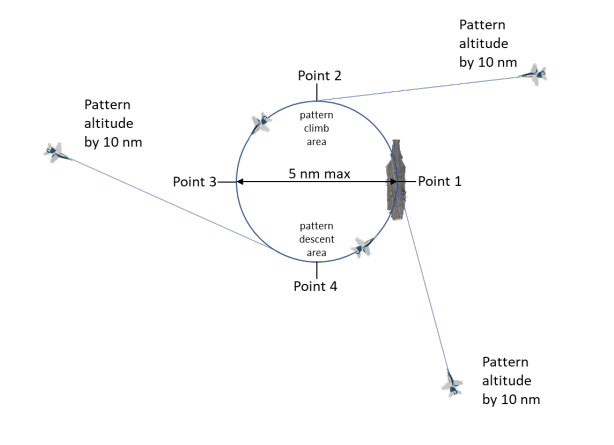
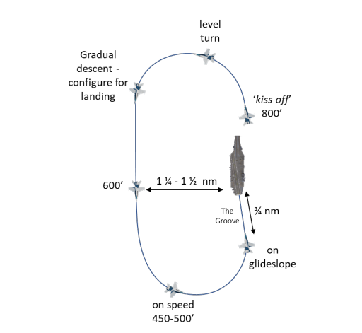
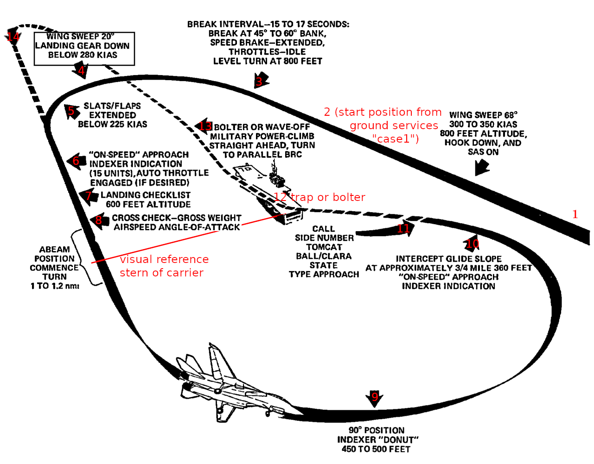

# LSO radio calls in the Case I pattern, and what triggers them

Date: 2026-09-16. Source: LSO NATOPS Manual, NAVAIR 00-80T-104 (May 2009), `docs/NATOPS/LSO-NATOPS-MAY09.pdf`,
sections 6.6.3.1 (recovery procedures) and 9.3 with Figure 9-1 (standard phraseology). Position
numbers in the table refer to the annotated F-14 Case I pattern in the last picture.

## The short version

In Case I the LSO says almost nothing. Control passes to the LSO at the 180 (position 8), the
pilot makes one mandatory call at the start of the groove (position 11), the LSO answers it, and
everything else the LSO says is a correction only when the pass needs one. Under ZIP LIP or EMCON
even the ball call is replaced by a 3 s flash of the cut lights.

## The four phases of a Case I recovery

### 1. Holding: the overhead stack

Flights arrive at pattern altitude by 10 nm and hold in a left-hand circle over the ship, point 1
over the carrier, 5 nm across. The stack starts at 2,000 ft and each flight holds 1,000 ft above
the one below. Radio: the pilot checks in with Marshal or Tower inbound, "(callsign), see you at
ten", with fuel state. Nothing to or from the LSO.

### 2. Commencing the approach: from the stack to the initial

Tower gives "Charlie" (or "99, Charlie" for the whole stack): the lowest flight leaves holding
from the far side of the circle, descends through the pattern descent area and arrives at the
initial 3 nm astern at 800 ft, on the ship's heading. "Kiss off" is the lead's hand signal that
sends wingmen to their own break interval, no radio. This is the only phase with a mandatory
Tower call and still none from the LSO.

### 3. Overhead break and the landing pattern

Level turn at 800 ft over the bow, downwind with a gradual descent to 600 ft while configuring,
abeam at 1 1/4 to 1 1/2 nm, the 90 at 450 to 500 ft on speed, wings level in the groove at 3/4 nm
on glideslope. The LSO takes control silently at the abeam. The only voice exchange is at the
start of the groove: the pilot's ball call and the LSO's "Roger ball".

### 4. The full pattern with numbered positions

The table below walks these positions.

## Who talks where

| Position | Where | Who | Call | Trigger |
| --- | --- | --- | --- | --- |
| Before 1 | Inbound at about 10 nm, then the overhead stack | Tower or Marshal, never the LSO | "99, Case I", pilot "(callsign), see you at ten", Tower "Charlie" to start the descent from the stack | Recovery start, aircraft checking in at 10 nm, Charlie time |
| 1 to 3 | Initial at 800 ft, overhead, break | nobody | none. The break is flown on the 15 to 17 s interval, no radio | |
| 4 to 7 | Upwind turn, downwind, dirty-up | nobody | none in Case I. FCLP only: pilot "(Modex), abeam, gear, (state), (name)" at the abeam | Reaching the abeam position with gear down |
| 8 | Abeam, the 180 | LSO, silently | none. Control transfers to the LSO here; the LSO watches the approach turn and will wave off a pattern that would give too short a groove | Aircraft abeam, starting the turn (§6.6.3.1 items 1 and 3) |
| 9 | The 90 | nobody | none | |
| 10 | Rolling out on final, about 3/4 nm | nobody yet | none. If the pilot has not called, the LSO or CATCC may prompt "(Modex), call the ball" | Wings level, no ball call heard |
| 11 | Start of the groove, ball acquisition | **Pilot** | "(Modex), (Type), ball, (state)", e.g. "205, Tomcat ball, 5.2". "Clara" replaces "ball" with no glideslope reference; "Clara lineup" with no lineup reference. Add "Auto" or "Coupled" when applicable, and any aircraft difficulty | Rolling wings level in the groove with usable ball, lineup and AoA (§6.6.3.1 item 4) |
| 11 | Same moment | **LSO** | "Roger ball" (+ "Auto"/"Coupled"). Optional information: "the deck is moving down", "the deck is steady", "winds are slightly starboard", "MOVLAS recovery" | The pilot's ball call |
| 11 | Same moment, after "Clara" | LSO | "Paddles contact" when the LSO takes the aircraft, then "Fly the ball" once the ball is usable, or "Continue" | The pilot's "Clara" call. If the pilot gets no timely answer, the pilot waves off (§6.6.3.1 item 6) |
| 11 to 12 | In the groove, start to ramp | LSO, only if needed | Informative: "You're (a little) high / low", "You're lined up left / right", "You're drifting left / right", "You're (a little) fast / slow". Advisory: "Don't settle", "Don't climb", "Back to the right", "Easy with it", "Hold what you've got", "Don't chase it". Imperative: "A little power", "Power", "Attitude", "Right for lineup", "Burner", "Level your wings" | A deviation the LSO sees or anticipates. Imperative calls demand an immediate response |
| 11 to 12 | Any time in the groove | LSO | "Waveoff", "Waveoff, foul deck", "Waveoff up the starboard side" | Unsafe approach, fouled deck, or an aircraft that would overfly the landing area |
| 12 | Touchdown | LSO | "Bolter" when the hook misses the wires. Nothing on a trap | Hook skip or hook up, aircraft still rolling at the end of the wires |
| 13 | Climb-out after bolter or waveoff | LSO, if needed | "Climb" when the aircraft has not set attitude and power for a positive rate of climb | Aircraft not climbing after bolter or waveoff |
| 14 | Back on downwind | nobody | none. In the fleet the grade is given in the ready room, not on the radio. In FCLP the LSO debriefs each pass on the radio between passes | End of the pass |

## Rules that shape the calls

- **One call, short, standard.** Section 9.3: calls that are too frequent or verbose degrade
  performance. The LSO limits itself to the phrases of Figure 9-1, and pilots are trained on them.
- **Three families, three expectations.** Informative calls describe the situation. Advisory calls
  point at a developing error. Imperative calls require an immediate control action, no
  judgment.
- **Control starts at the 180, not at the ball call.** The LSO owns the aircraft from the abeam
  position and can wave it off during the approach turn.
- **"Clara" must be answered.** It is the one case where LSO silence has a defined consequence:
  the pilot waves off.
- **ZIP LIP and EMCON.** No voice. The LSO acknowledges the aircraft with a steady 3 s cut-light
  flash, and later flashes command power, the duration giving the amount.

## What this means for an automated Paddles

| Call | Can the LSO tool make it today | Trigger already in the code |
| --- | --- | --- |
| "Roger ball" | Yes, unprompted by geometry, or in reply once the pilot's call is heard | `Track::entered_groove()` |
| "Call the ball" | Yes | groove entry plus about 3 s with no ball call heard |
| "Bolter" | Yes, 1 to 2 s late | `Grading::Bolter` |
| Deck and wind information after "Roger ball" | Yes | wind query, carrier transform |
| Corrective calls in the groove | Not yet; needs real-time thresholds and a measured delay | live gate deviations exist but are used after the pass |
| "Waveoff" | No, only after the fact | `Grading::WaveoffUnknown` is detected once the aircraft has left the groove |
| Grade on the radio | Possible, but not what a fleet LSO does. An FCLP-style debrief between passes is the closest real practice | `Track::finish()` |
