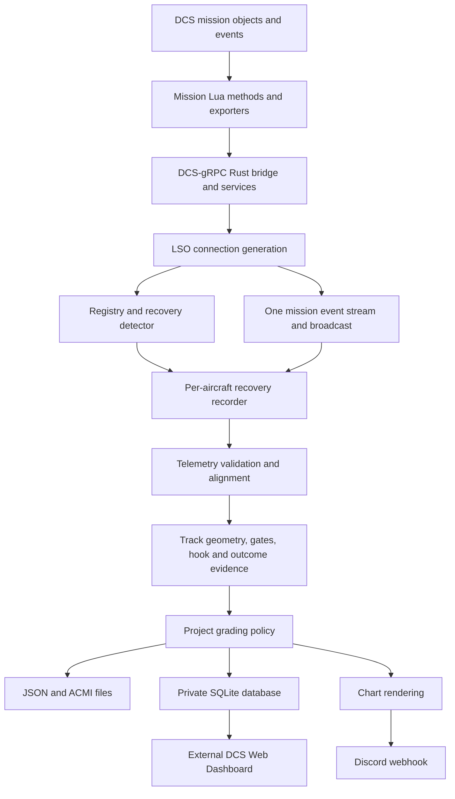

# Rust and DCS integration review

- Review date: **12 September 2026**
- Repository: `sevenfifty777/DCS-gRPC-lso`
- Branch: `astra-review`
- Reviewed commit: `a8c63d111e9dec00216c461c04310db25856715a`
- Application: `lso 0.4.0`

## 1. Assessment

The project has a useful separation between DCS acquisition, recovery tracking, grading, presentation, and persistence. Its strongest features are explicit incomplete results, recorded gate evidence, separate CATOBAR and V/STOL policies, authoritative DCS wire handling, bounded detector concurrency, and an extensive set of recorded-flight regression fixtures.

The reviewed revision **builds and passes all 148 existing tests**, but it still has defects that can lose a completed pass, alter V/STOL touchdown accuracy, leave old recovery tasks alive, or prevent an eventless arrest from finishing. These should be addressed before tuning grading thresholds or adding more presentation features.

Four focused probes against the current production modules reproduced additional behavior not rejected by the existing suite:

1. A duplicate V/STOL touchdown returns `false` yet changes the recorded spot distance from 0 m to 12 m.
2. Kinematic arrest evidence continues to report a 2-second hold after more than 14 seconds of stationary post-contact data; the recorder expects an 8-second hold to finish without a landing event.
3. The telemetry aligner accepts an aircraft position containing `NaN` as valid.
4. Replay accepts a timestamp reversal from 2 seconds to 1 second and reports a zero sample gap.

These are source-level and isolated runtime findings. No running mission, cockpit, production database, Discord webhook, or dashboard was exercised. The report recommends focused changes; it does not implement them.

## 2. Scope and evidence

### 2.1 What was inspected

- Rust startup, configuration, reconnection, task ownership, discovery, and event distribution.
- gRPC client wrappers and the actual adjacent protobuf definitions.
- Atomic and legacy telemetry acquisition, clock handling, gate capture, hook evidence, arrest confirmation, and V/STOL touchdown processing.
- ACMI replay, JSON/SQLite persistence, chart selection, Discord publication, and runtime metrics.
- Cargo configuration, lockfile auditing, CI, administrator documentation, and data contracts.
- The bundled DCS Lua recovery methods, buffered telemetry engine, object exporter, event exporter, request scheduler, and ownship hook integration.

This is a detailed review of the critical paths, with broader module inspection. It is not a line-by-line audit of every bundled server method, DLL, image, historical document, or flight recording.

### 2.2 Ownership and version boundaries

| Component | Evidence inspected | What this establishes |
|---|---|---|
| LSO application | Commit above; clean worktree at start | Exact application revision reviewed |
| Build-time server bindings | `../rust-server/stubs`, package `0.9.2` | The local build uses sibling source rather than an immutable dependency |
| Adjacent server | Clean `main`, commit `16291fbab9585e6fd8c223e21b0da12fd1a954cd` | Local protobuf, RPC adapter, and authentication behavior; not deployed server state |
| Bundled Lua | `docs/DCS-gRPC-0.9.2/Scripts/` | Reference integration present in this repository; not proof of what DCS has loaded |
| Graphify | Index built at `a25303e757b587019f7be1f446c2927f16ebab47` | Stale relative to reviewed HEAD; excluded as finding authority |
| Live DCS and dashboard | Not contacted | Runtime behavior and deployment configuration remain unverified |

The Graphify query failed with `Failed to canonicalize script path`; source inspection was used instead. The sibling repository required a command-scoped Git ownership exception for read-only inspection; no global Git configuration was changed.

References below use paths relative to the repository root and line numbers at the reviewed commit. Numbers will move when fixes are made.

### 2.3 Finding classification

- **P1:** prioritize next; may lose or misattribute a result, change scoring evidence, or leave acquisition running incorrectly.
- **P2:** material reliability, reproducibility, or integration issue; schedule after immediate correctness fixes.
- **P3:** maintenance, presentation, or diagnostic improvement.
- **Confirmed:** follows directly from the current implementation; live frequency may be unknown.
- **Reproduced:** additionally exercised through an isolated probe using production modules.
- **Risk/proposal:** an observed design limitation whose practical impact needs deployment or flight evidence.

## 3. Architecture and data flow



The diagram describes logical ownership, not transactional guarantees. Persistence, rendering, and publication currently remain inside the same recorder task.

### 3.1 Startup and discovery

`main.rs` configures tracing and Ctrl-C handling. `commands/run.rs` opens `<out-dir>/lso.db`, starts metrics, and runs connection generations with exponential reconnect backoff. A generation reads the server version/session ID, lists groups and units, resolves pilot identity by occupied slot, and creates a registry.

`tasks/detect_recovery_attempt.rs` polls at a nominal two-second interval. It limits concurrent transform calls to four, queries each carrier and idle aircraft once per sweep, and pairs an aircraft with the nearest compatible carrier. Detection accepts aircraft within 3.5 nm and below 1,100 ft MSL, excluding distances below 200 m. These are broad project detection limits, not a full carrier-pattern classification.

### 3.2 Services and exact client operations

All listed services use the `dcs.<domain>.v0` protobuf namespace. The configured endpoint defaults to `http://127.0.0.1:50051`.

| Purpose | RPCs and relevant payload |
|---|---|
| Startup identity/version | `MetadataService.GetVersion`, `MissionService.GetSessionId` |
| Initial discovery | `CoalitionService.GetGroups { coalition: All, category: 0 }`; `GroupService.GetUnits { group_name, active: true }` |
| Eligibility and metadata | `UnitService.GetDescriptor { name }`, `UnitService.Get { name }` |
| Detector and legacy observations | `UnitService.GetTransform { name }` |
| Atomic observations | `RecoveryService.GetRecoverySnapshot { carrier_name, aircraft_name, aircraft_draw_argument, sequence }` |
| Legacy hook animation | `UnitService.GetDrawArgumentValue { name, argument }` |
| Event feed | `MissionService.StreamEvents {}`; one source stream per generation, local broadcast capacity 256 |
| Pilot attribution | `NetService.GetPlayers {}`; slot matched to unit ID/name |
| Report metadata | `MissionService.GetScenarioStartTime`, `GetScenarioCurrentTime`; `HookService.GetMissionName`; `WorldService.GetTheatre` |
| Optional ownship diagnostic | `HookService.GetOwnshipHookState {}` |
| Discord wind annotation | `AtmosphereService.GetWind { position: { lat, lon, alt } }` |

Unary request helpers attach a nominal two-second `grpc-timeout`; atomic snapshot timeout defaults to 250 ms. The event stream deliberately has no whole-stream deadline. Authentication metadata is currently absent; see F07.

### 3.3 Atomicity, clocks, and geometry

The snapshot Lua callback looks up the two named units, captures `timer.getTime()`, reads the optional hook argument, and exports both transforms. The objects are read sequentially within one callback. This gives a shared callback timestamp, **not a simulator-wide transactional snapshot or proof that the ship's position advanced**. The actual protobuf makes this limitation explicit in `../rust-server/protos/dcs/recovery/v0/recovery.proto:9-14`.

The exporter maps DCS world coordinates into `u = z`, `v = x`. LSO stores `(u, altitude, v)` and converts velocity vectors accordingly. Carrier and aircraft local offsets are rotated using the stored orientation. Calibration of individual offsets still needs module-specific evidence.

`TelemetryAligner` distinguishes DCS time from monotonic reception time. Its thresholds are 100 ms direct skew, up to 300 ms extrapolation with valid history, warnings above 300 ms gaps/frozen-source age, and incomplete samples above 1,000 ms. The active watchdog uses 2,000 ms. These are project policies rather than guaranteed DCS sampling characteristics.

### 3.4 Grading and outputs

Three gates at 1,389, 926, and 463 m provide ordered GS/lineup evidence. Gate capture requires valid inbound brackets no more than 300 ms apart. CATOBAR grading uses the worst gate deviations; V/STOL averages gate points and can add a spot-accuracy bonus after recovery. AOA changes trace color, not points.

Deck contact, arrest confirmation, wire number, approach quality, and technical completeness are distinct concepts. DCS wire evidence takes precedence over the independent estimate. Hook animation is interpreted through a pre-contact baseline and a correlated transient, while kinematics can confirm an arrest without naming a wire.

The recorder writes schema-8 JSON and optional ACMI, inserts a private SQLite row, renders approach/pattern PNGs with `spawn_blocking`, and optionally publishes to Discord. Since 0.4.0, this application serves no web page: the external dashboard reads SQLite. Dashboard routes, authorization, and browser behavior are outside this checkout and were not verified.

## 4. Prioritized findings

| ID | Priority | Finding | Evidence |
|---|---|---|---|
| F01 | P1 | Generation cancellation does not own and drain all child tasks | Confirmed |
| F02 | P1 | `NOT_FOUND` discards a pass even after accepted touchdown | Confirmed |
| F03 | P1 | Rejected duplicate V/STOL touchdown changes spot evidence | Reproduced |
| F04 | P1 | Eventless kinematic arrest cannot reach its normal finishing threshold | Reproduced |
| F05 | P1 | Invalid geometry is accepted; invalid samples can mutate tracking state | Reproduced/confirmed |
| F06 | P1 | Startup and subscriber timing can miss births and landing events | Confirmed windows; live incidence unmeasured |
| F07 | P2 | Authenticated servers are unsupported and permanent errors retry | Confirmed |
| F08 | P2 | Available source-buffered telemetry is not consumed by LSO | Confirmed integration gap |
| F09 | P2 | Cadence-dependent carrier smoothing affects grading geometry | Confirmed; score impact needs corpus comparison |
| F10 | P2 | ACMI replay does not preserve all live evidence semantics | Reproduced/confirmed |
| F11 | P2 | Output helper does not guarantee first-writer-wins behavior | Confirmed race |
| F12 | P2 | Publication failure has no durable retry, and finalization holds detection slot | Confirmed |
| F13 | P2 | Path dependency and floating CI server ref defeat reproducible builds | Confirmed |
| F14 | P2 | Name-only telemetry can cross unit incarnations | Confirmed contract limitation |
| F15 | P3 | Report provenance and timestamps are incomplete or ambiguous | Confirmed |
| F16 | P3 | Long-running resource use is not bounded end to end | Confirmed design limitation |
| F17 | P3 | Reported AOA is a ground-velocity angle, not calibrated aerodynamic AOA | Confirmed formula; cockpit impact unmeasured |
| F18 | P3 | Dependency maintenance warning and diagnostic/documentation gaps | Current audit/source evidence |

### F01 — Generation cancellation does not own and drain all child tasks

**References:** [run.rs](../src/commands/run.rs), lines 150-190, 359-372, 508-517; [detect_recovery_attempt.rs](../src/tasks/detect_recovery_attempt.rs), lines 33-43 and 107-109; [shutdown.rs](../src/utils/shutdown.rs), lines 53-61.

There are three related paths:

1. The supervisor is spawned **before** awaiting `stream_events()`. If stream setup fails, `?` returns from `run()` before the cleanup at the bottom. Dropping its handle detaches the supervisor.
2. On ordinary generation failure, `run()` aborts the supervisor. Its `active` map contains plain `JoinHandle`s; aborting the supervisor drops that map without executing the explicit drain after its loop. The child recorders remain detached.
3. On Ctrl-C, the outer `select` can drop the active `run()` future before its bottom cleanup. The shutdown signal is delivered, but completed-pass finalization and child joins are not awaited by `execute()` before returning and allowing the runtime to shut down.

Tokio documents that dropping a `JoinHandle` detaches its task; aborting a parent task does not recursively cancel children. See [Tokio JoinHandle](https://docs.rs/tokio/latest/tokio/task/struct.JoinHandle.html).

**Impact:** old and new generations can overlap. Old recorders can continue polling the same unit names under an old session/generation, publish duplicate results, or lose results when the process exits. Recorders also retain an event sender through their context, so an orphan does not reliably notice that the real source stream ended merely through broadcast closure. The generation number in `recovery_id` makes overlapping results distinct rather than deduplicating them.

**Recommended change:** introduce an explicit generation owner with cancellation and tracked child joins. Establish the event subscription before starting discovery/recording work. On every return path, stop intake, notify recorders, allow bounded finalization, and join them; abort and drain any remaining work. Use a `JoinSet` or an equivalent owned task collection. An abort-on-drop guard is a useful fallback, but cannot by itself guarantee saved results. Reap completed joins and report panics instead of dropping finished handles in `active.retain`.

**Acceptance:** force event-subscription failure repeatedly; interrupt the event stream during two recoveries; switch mission IDs; send Ctrl-C during JSON/DB finalization. Assert that generation N has no live recorder after N+1 begins and that each eligible completed pass is persisted once.

### F02 — `NOT_FOUND` discards a pass even after accepted touchdown

**References:** [record_recovery.rs](../src/tasks/record_recovery.rs), lines 556-559, 1002-1018, and 1025 onward.

The telemetry-error branch returns `Ok(())` immediately for `Code::NotFound`. By contrast, the Crash/Dead/PlayerLeaveUnit/UnitLost event branch preserves evidence when touchdown has already been accepted and breaks into finalization.

**Trigger:** the aircraft traps, an event is accepted, and the player leaves or the unit is removed before the ten-second post-touch window ends. If the next snapshot returns `NOT_FOUND` before the removal event is consumed, all in-memory evidence bypasses persistence. The outcome depends on arrival order.

**Recommended change:** route unit disappearance through one finalization decision shared by RPC errors and events. Keep already-established recovery/contact evidence, record the termination reason, and finish with explicit completeness. Include kinematic arrest/DCS wire evidence in the decision; `track_stopped.is_some()` alone only describes an accepted landing event. Before contact, retain the current discard policy or explicitly record an incomplete attempt according to the product policy.

**Acceptance:** inject touchdown then `NOT_FOUND`, reversing the removal-event/RPC-error order. Both orders must preserve the same pass and evidence, with no fabricated wire or points.

### F03 — A rejected duplicate V/STOL touchdown changes spot evidence

**References:** [track.rs](../src/track.rs), `Track::landed`, lines 1221-1352.

V/STOL processing calculates `spot_distance_m`, updates `actual_nearest_spot`, updates spot-zone observations, and can append a terminal datum **before** checking whether a recovery was already accepted. The duplicate check at the end returns `false`, but those mutations have already occurred.

**Reproduction:** construct a Tarawa/AV-8B track; accept a touchdown at spot 7.5 at DCS time 10; call `landed` again at time 11 after moving the reference 12 m laterally. Production code reports:

```text
first_accepted=true
second_accepted=false
touchdown=Some(10.0)
final_spot_distance=Some(12.0)
```

**Impact:** a later Land/RunwayTouch event or bounce can overwrite the first-contact accuracy and therefore the V/STOL bonus. The saved timestamp still points to the first contact, making the resulting evidence internally inconsistent.

**Recommended change:** decide event admissibility before mutating touchdown/score state. Store one immutable accepted touchdown observation. If later contact/taxi observations are useful for rendering or diagnostics, keep them in a separate collection that cannot modify the accepted spot score.

**Acceptance:** first contact at 0 m followed by duplicates at 12 m and 1 m preserves the first distance, spot grade, and touchdown time. Repeat with an older duplicate timestamp, a bounce, and reversed Land/RunwayTouch arrival. Preserve current CATOBAR outcomes.

### F04 — Eventless kinematic arrest cannot reach its normal finishing threshold

**References:** [track.rs](../src/track.rs), lines 987-1016 and `evaluate_arrest_kinematics`, lines 1585-1696.

With no Land/RunwayTouch event, `next_sample` can establish `Recovered` from deck kinematics. Its finishing condition then requires `held_s >= MAX_HOOK_DEFLECTION_RECOVERY_S`, which is 8 seconds. However, `evaluate_arrest_kinematics` scans from the beginning and returns at the first qualifying hold of `ARREST_HOLD_S`, which is 2 seconds.

**Reproduction:** a deck-crossing reference at time 100 and stationary 10 Hz deck samples through time 114.4 produce `confirmed=true, held_s=Some(2.0)`. Re-evaluation continues to find that earliest 2-second result. It does not return the duration of the ongoing hold.

**Impact:** the normal no-event finishing condition cannot become true for this input. With good telemetry and an aircraft staying near the carrier, the recorder can continue until some other exit condition occurs; the recovery is not promptly persisted and the detector slot remains occupied.

**Recommended change:** separate immutable arrest confirmation from current post-arrest observation duration. Record `arrest_confirmed_at` or the accepted contact reference and finish after an explicit bounded evidence window. If reporting ongoing hold length is desired, calculate it separately rather than changing the historical confirmation meaning.

**Acceptance:** feed a no-event approach followed by a confirmed stop and 15 seconds of deck motion. It must finish once, within the configured post-arrest window. A two-second stop followed by departure must follow an explicitly tested policy and must not invent a wire.

### F05 — Invalid geometry is accepted, and invalid samples can change tracking state

**References:** [recovery_client.rs](../src/client/recovery_client.rs), lines 111-136; [unit_client.rs](../src/client/unit_client.rs), lines 33-57; [transform.rs](../src/transform.rs), lines 36-96; [telemetry.rs](../src/telemetry.rs), lines 119-251; [track.rs](../src/track.rs), lines 713-1218 and 2142-2222.

The atomic client requires the top-level position/orientation/velocity messages but does not validate their numeric fields. The legacy client substitutes default transforms for missing messages. `TelemetryAligner` primarily validates timestamps, skew, and reception gaps; it does not reject non-finite position, attitude, or velocity components. A direct probe with `plane.position.x = NaN` returned `sample.is_valid() == true`.

There is a second boundary problem: even a sample already marked invalid can update carrier smoothing, `last_x`, distance minima, outcome logic, groove entry, and gate-reset state. Some downstream operations check `sample.is_valid()`, but there is no single boundary preventing invalid evidence from influencing the state machine. Non-finite gate values also lack an explicit finite-value guard at final gate acceptance/grading.

**Impact:** malformed or partially populated RPC data can become plausible zero-position telemetry or contaminate future geometry. A stale/skewed observation can change how subsequent valid samples are classified. Existing incomplete-result logic mitigates some scoring paths but does not restore state already changed.

**Recommended change:** add a validated observation type at the client boundary. Require finite scoring coordinates, time, velocity, and the orientation components actually used; represent missing optional observations explicitly. Preserve invalid raw samples and quality counters, but stop them before they mutate authoritative geometry/outcome state. Require finite GS/lineup values at gate capture and final grading. Treat unavailable AOA separately because it is presentation-only.

**Acceptance:** missing nested vectors, `NaN`/infinity in each required component, backward time, excessive skew, and a transport gap must not create a gate, touchdown, or favorable score. Follow each invalid observation with valid data to test recovery from the error, not just rejection of one isolated sample.

### F06 — Event acquisition has startup gaps and blocking work in its intake loop

**References:** [run.rs](../src/commands/run.rs), lines 243-328 and 372-444; [record_recovery.rs](../src/tasks/record_recovery.rs), lines 367-456 and 730-744; [tasks/mod.rs](../src/tasks/mod.rs), lines 25-52.

Three observed ordering choices can remove or delay evidence:

- The initial group/unit inventory is fetched before `StreamEvents` is established. A unit born after its group was enumerated but before subscription can be absent from both the inventory and subsequent event feed. No periodic full reconciliation repairs that case within the generation.
- A recorder subscribes to the local broadcast after its capability probe and optional metadata RPCs. Touchdown or landing-grade events emitted during this initialization are not replayed to the new subscriber.
- The one event-intake task awaits descriptor/eligibility and player-list RPCs while handling Birth. A sequence of slow births delays forwarding landing events for every active recorder. If broadcast lag occurs, the recorder logs an event-evidence entry but does not explicitly set an event-delivery completeness state.

**Impact:** dynamically spawned aircraft may never be monitored until reconnect, and late-start recoveries can miss their most useful contact/wire evidence. Delayed DCS grades can arrive after a recorder has finished. Not every missed event makes a grade wrong because kinematics and other evidence may suffice; the missing-source state should nevertheless be explicit.

**Recommended change:** subscribe first, buffer events with a bounded policy, take the inventory, then reconcile events with the inventory before normal supervision. Subscribe each recorder immediately when it is created. Move enrichment RPCs off the event intake path into a bounded worker. Keep the critical fan-out fast. Model event delivery health separately and apply a documented policy when an outcome depends on possibly lost events.

**Acceptance:** births during inventory, touchdown during recorder setup, slow `GetPlayers`, and a deliberate broadcast overrun must have deterministic, tested outcomes. Verify both busy CATOBAR and V/STOL missions.

### F07 — Authenticated DCS-gRPC servers are unsupported, and permanent failures retry

**References:** [client/mod.rs](../src/client/mod.rs), lines 15-28; [mission_client.rs](../src/client/mission_client.rs), lines 46-55; [run.rs](../src/commands/run.rs), CLI options and lines 150-189. Server reference: `../rust-server/src/authentication.rs:17-49`.

No CLI/environment configuration or interceptor supplies `X-API-Key`. Every wrapper creates a plain service client, and the event stream constructs a plain request separately. The inspected server returns `UNAUTHENTICATED` when authentication is enabled and the metadata is absent.

The reconnect loop classifies failures mainly by elapsed connection lifetime. An authentication failure is retried like a transient outage. Forced atomic mode on a server returning `UNIMPLEMENTED` ends the generation, but the outer loop still reconnects, so the incompatibility is not a true process-level permanent failure.

**Impact:** deployments that enable authentication cannot use this client. Operators can see an apparently retrying service instead of a clear configuration error. This finding does not claim that the user's current server has authentication enabled.

**Recommended change:** support an explicit secret environment variable and a shared interceptor covering every unary RPC and stream. Mark metadata sensitive and never include its value in logs. Fail clearly if a configured credential is missing or invalid. Classify authentication, permission, invalid-argument, and forced-capability failures as operator-action errors; retry transient availability failures with cancellation and bounded backoff. Preserve unauthenticated loopback operation when that is explicitly the server's policy. Tonic provides [request metadata access](https://docs.rs/tonic/0.13.1/tonic/struct.Request.html).

**Acceptance:** a fake authenticated server accepts version, discovery, snapshots, and event subscription with the key; rejects missing/wrong keys once with a useful error; logs never contain the key. A transient disconnect still reconnects.

### F08 — Source-buffered telemetry exists on the server but is not used by LSO

**References:** [recovery_client.rs](../src/client/recovery_client.rs); [record_recovery.rs](../src/tasks/record_recovery.rs), lines 495-547; bundled [recovery.lua](DCS-gRPC-0.9.2/Scripts/DCS-gRPC/methods/recovery.lua), lines 115 onward; [recovery_telemetry.lua](DCS-gRPC-0.9.2/Scripts/DCS-gRPC/recovery_telemetry.lua), lines 304-660. Contract: `../rust-server/protos/dcs/recovery/v0/recovery.proto`.

LSO still awaits one unary snapshot on each nominal 100 ms tick. `MissedTickBehavior::Skip` avoids a catch-up burst, but cannot recover observations that were never captured. Atomicity fixes within-observation skew; it does not guarantee 10 Hz acquisition under IPC latency or pauses in the client.

The inspected server contract already exposes `StartRecoveryTelemetry`, `ReadRecoveryTelemetry`, and `StopRecoveryTelemetry`. The bundled engine supports a source epoch, sequence cursor, unit-ID checks, bounded retention/capacity, leases, carrier observation sharing, and loss diagnostics. No LSO wrapper calls those RPCs.

**Recommended staged integration:**

1. Retain atomic unary acquisition as the current baseline and rollback option.
2. Add an explicitly selected buffered mode after pinning the compatible server contract.
3. Start capture with both unit IDs and names; retain the returned epoch and configured period.
4. Read batches with an exclusive cursor; advance the cursor only after validating/accepting the batch. Handle retries without duplicating samples.
5. Treat epoch changes, identity mismatch, lifecycle expiry, retention loss, and capacity overflow as typed evidence discontinuities.
6. Stop capture during normal finalization and generation teardown; rely on leases only as a backup.
7. Measure source cadence separately from network batch cadence.

**Important compatibility limit:** the inspected buffered snapshots contain unit transforms but do not contain the atomic API's hook draw-argument observation. Switching wholesale would remove hook evidence unless a timestamped hook source is preserved or added. Also, `readsPerSecond` is enforced in the server RPC layer; a client must obey the configured per-owner quota across all active recoveries, not just per recorder. At a 20 Hz source period and a 100-snapshot batch cap, one batch can represent up to five seconds of data, but the actual poll policy must balance latency, retention, and the shared quota.

**Acceptance:** compare unary and buffered observations on the same labelled flights; introduce delayed reads without source loss, then actual ring overflow; distinguish those two cases in the result. Preserve hook, V/STOL, event, and wire semantics before considering buffered mode the default. This is a proposal, not an implemented client capability.

### F09 — Carrier smoothing changes grading geometry and depends on sample cadence

**References:** [track.rs](../src/track.rs), lines 61-73 and 795-863; gate input construction at lines 1116 onward; [draw.rs](../src/draw.rs), chart selectors.

The carrier EMA is applied before calculating `landing_pos`, distance, angled-deck `x`, and lineup `y`. Those values feed gate interpolation, groove detection, and outcome logic. The smoothing therefore affects grading, not just presentation. It advances on received samples with a fixed alpha of 0.15, including samples that may already be invalid.

For a constant-velocity input sampled regularly, the steady-state lag is approximately `(1-alpha)/alpha` samples. At 10 Hz this is 0.567 seconds; at 5 Hz it is 1.133 seconds. For a ship travelling at 15 knots, these correspond to about 4.37 m and 8.74 m. These are analytical examples, not measurements of this deployment. DCS stepped positions and turns require separate evaluation. The comment's grading-tolerance claim is not a substitute for a cadence sensitivity test.

**Recommended change:** keep authoritative measurement geometry separate from chart smoothing. First compare raw/aligned geometry with the current EMA on the labelled corpus. If a reconstruction is needed for measurement, make it time-aware, version it, expose its uncertainty, and validate it as part of the measurement model. Keep display interpolation in the renderer. Do not silently remove smoothing and retune thresholds in the same change.

**Acceptance:** the same source trajectory delivered in different batch sizes/network schedules produces the same gates and score. Include constant speed, changing BRC, source-position steps, and dropped observations. Maintain separate CATOBAR and V/STOL baselines.

### F10 — ACMI replay does not preserve all live evidence semantics

**References:** [telemetry.rs](../src/telemetry.rs), lines 66-103 and 151-201; [file.rs](../src/commands/file.rs), lines 27-34 and 290-414; [record_recovery.rs](../src/tasks/record_recovery.rs), lines 198-222, 637-675, and 829-969; [DATA_CONTRACTS.md](DATA_CONTRACTS.md), ACMI hook description.

Several differences limit reproducibility:

1. `from_replay` clamps a negative time delta to zero and has no equivalent of the live `TimeWentBackwards` check. The probe using current time 1 with previous time 2 returned valid with `gap_ms=0`.
2. Replay treats a permitted skew as direct evidence; live alignment may extrapolate with history or reject the same input. ACMI lacks reception timing and source-age diagnostics, so full live telemetry health cannot be reconstructed from it alone.
3. In legacy independent hook mode, `hook_state` remains `None` in the position loop. The separately drained hook samples update `Track` but are not emitted as `LSOHook` ACMI properties. The CLI `file` command also supplies no hook sidecar, although test helpers support one. The documentation's unconditional embedded-hook statement is too broad.
4. The generic Land handler updates the live track but writes no Landed ACMI event. RunwayTouch does write one. If only Land is available, replay lacks the event used by the live result; this particularly matters to V/STOL touchdown evidence.
5. Event transforms are written with event times and share the ACMI delta-compression cache with normal samples. Late events can introduce backward frames, precisely where the replay validator is currently weakest.

**Recommended change:** define the replay contract explicitly. Use a canonical timestamped observation/event record for exact regrading; retain ACMI for visualization/export. Record acquisition mode, source time, invalidity, identity, hook samples, and event correlation separately. If ACMI remains a supported regrading input, normalize Land/RunwayTouch persistence, reject or deliberately reorder backward frames, and document which fields cannot be reproduced. Do not claim exact live equivalence from a test that sends equivalent already-constructed transforms directly into `Track`.

**Acceptance:** golden fixtures compare live versus replay outcomes, accepted touchdown, hook state, gates, and completeness for atomic mode, legacy independent hook mode, Land-only V/STOL, and late events. Differences caused by absent reception diagnostics must be explicitly classified.

### F11 — `write_atomic_if_absent` can overwrite an existing target in a race

**References:** [record_recovery.rs](../src/tasks/record_recovery.rs), lines 1538-1561 and test at lines 2001 onward.

The helper checks existence, writes a unique temporary file, then renames it to the target. Two writers can both pass the initial check. Rename can replace an existing file, so the second completed rename can overwrite the first. The existing test verifies that a complete payload is present, not that the first successful publication is preserved.

This is an atomic-publication pattern, but not an atomic no-clobber pattern. Rust documents target replacement for [filesystem rename](https://doc.rust-lang.org/std/fs/fn.rename.html). In addition, an existing path is accepted without checking that it is a valid artifact or contains the expected recovery.

**Recommended change:** use a no-replace publication primitive supported by the target filesystem, or coordinate publication through the authoritative database/one writer. Return an explicit `Created`, `AlreadyPresentMatching`, or conflict outcome. Do not fix this by writing bytes directly to a visible target after `create_new`, because readers could then observe partial content. If crash durability is required, add explicit file/directory durability handling and a recovery procedure; rename alone is not a complete durability protocol.

**Acceptance:** synchronize two writers so both reach publication with different payloads; verify that the first committed artifact cannot be replaced. Verify corrupt pre-existing output, permission errors, cancellation, and leftover temporary files. Run on the supported Windows filesystem and Linux CI.

### F12 — Finalization holds the detector slot, and Discord failures have no durable retry

**References:** [record_recovery.rs](../src/tasks/record_recovery.rs), lines 1285-1535; [detect_recovery_attempt.rs](../src/tasks/detect_recovery_attempt.rs), lines 42-54 and 159-190; [db.rs](../src/db.rs), lines 229 onward.

SQLite persistence before rendering is a good design choice. However, the recorder task remains active through rendering, wind lookup, attachment loading, and webhook execution. The detector excludes its aircraft until that entire task finishes. Slow publication can delay monitoring of the next attempt.

Discord is attempted only when the database insert returns `Some(true)`. If the insert succeeds and publication fails, a later duplicate insert is ignored and does not retry the message. No persistent pending/sent delivery record exists. The current design therefore provides a best-effort attempt for each newly inserted pass, not guaranteed eventual delivery.

The session log is updated before the database insert and deduplicates by filename; database uniqueness uses `recovery_id`. File writes and database writes are independent. Consequently, partial output sets and differences between the in-memory board and durable board are possible after failures.

**Recommended change:** end acquisition once evidence is finalized. Enqueue an immutable completed recovery for bounded persistence/rendering work so a publication delay cannot hold the aircraft's detector slot. For reliable Discord delivery, insert the pass and an outbox entry in one SQLite transaction, then process the outbox with retry/backoff and a stored delivery result. Do not promise exactly-once external posting: a crash after a successful HTTP response but before recording it can still require reconciliation.

**Acceptance:** after a successful DB insert, fail rendering or webhook delivery, restart the worker, and verify recovery of pending work without inserting a second pass. A new approach by the same aircraft can start while the prior result awaits publication.

### F13 — The server path dependency and floating CI ref defeat reproducible builds

**References:** [Cargo.toml](../Cargo.toml), lines 36-42; [.github/workflows/ci.yml](../.github/workflows/ci.yml), server checkout and Cargo commands; [ADMIN_GUIDE.md](ADMIN_GUIDE.md), compatibility section.

`stubs` resolves from `../rust-server/stubs`. The checked-in lockfile does not pin the contents of that local path. CI clones the server's floating `main`, and its build/test/Clippy commands do not use `--locked`. Two builds of this exact LSO commit can therefore consume different server bindings, workspace settings, or build scripts. Local validation succeeded against the particular sibling commit recorded in section 2; it does not establish future CI reproducibility.

**Recommended change:** select and verify an immutable server Git revision or an actual published release tag containing the required RPCs. Pin the same source in local dependency resolution, CI, and the deployment manifest. Keep the established dependency-range policy unless deliberately changing it; exact server source and a committed application lockfile are the immediate requirement. Use `--locked` in CI and validate `--all-targets` where relevant. Verify a clean checkout without a pre-existing sibling repository.

The bundled folder name `DCS-gRPC-0.9.2` and a package version of `0.9.2` do not independently establish the identity of a deployed DLL/Lua bundle or publication of a Git tag.

**Acceptance:** a clean machine resolves the same server revision and builds the application without local checkout assumptions. The release records application commit, server commit, protobuf identity, and deployed DLL/Lua hashes. No dependency version was changed or newly recommended as security-verified in this review.

### F14 — Name-only transform requests can cross a unit incarnation

**References:** [run.rs](../src/commands/run.rs), lines 398-430 and 520-558; [recovery_client.rs](../src/client/recovery_client.rs), lines 47-58; [unit_client.rs](../src/client/unit_client.rs), lines 40-42; bundled [recovery.lua](DCS-gRPC-0.9.2/Scripts/DCS-gRPC/methods/recovery.lua), lines 26-43.

The registry and event handlers identify units by ID, but both unary acquisition paths query transforms by name alone. The atomic response contains transforms and the echoed client sequence, not the resolved DCS IDs. A same-name respawn can consequently feed a new aircraft's geometry into an old recorder whose pilot, unit ID, and session context are unchanged. Lost removal events, delayed event processing, and F01 make this easier to encounter.

Pilot identity is resolved at initial discovery/Birth. Slot occupancy changes without a corresponding usable Birth are not reconciled by the current registry loop. Slot matching avoids homonym confusion, which is good, but does not make the cached attribution current forever.

**Recommended change:** bind observations to `(session/source epoch, unit ID, unit name)` and end an attempt on incarnation change. The buffered contract already carries expected and resolved IDs; use that facility if adopting F08. For unary mode, add compatible server-side expected-ID validation or perform a carefully versioned identity check. Refresh registry occupancy on relevant lifecycle events or a bounded reconciliation schedule while keeping each started recovery's identity immutable.

**Acceptance:** respawn an aircraft with the same name and a different ID/pilot while the old recorder is active. Its observations must never be assigned to the prior pilot or merged into the prior approach. Include late removal events and missing player-list data.

### F15 — Report provenance and time labels need stronger definitions

**References:** [record_recovery.rs](../src/tasks/record_recovery.rs), lines 352-354, 1073-1090, 1109-1116, 1171-1222, and 1317-1320; [DATA_CONTRACTS.md](DATA_CONTRACTS.md).

- `lso_commit` uses `option_env!("GIT_COMMIT_HASH").unwrap_or("unknown")`. The inspected normal build/CI path does not populate it. Successful builds can therefore emit no source identity.
- `grading_version` is the broad constant `project-derived-v1`; by itself it does not identify the geometry, thresholds, or calibration used for an individual result.
- SQLite `grade_date` and the Discord UTC date use the timestamp captured at recorder startup. Mission datetime is queried after the recording ends. JSON separately records start/completion/contact times, but the various display/date fields can refer to different instants.
- After `Track` has a grading outcome, normal `Datum` collection returns early, although hook and deck kinematics continue. JSON includes an arrest summary, not the complete internal deck-kinematic series. An audit relying only on JSON cannot necessarily recompute the full arrest confirmation.

**Recommended change:** embed build provenance through a controlled release build step; include a grading/calibration version or configuration hash. Define `recording_started_at`, `touchdown_time_dcs`, `finalized_at`, and the timestamp used for board grouping explicitly. Capture enough canonical post-contact evidence to recompute arrest confirmation, especially with `--no-acmi`. Add fields without silently changing old column meanings.

**Acceptance:** a release-built report contains an exact source identity; a recovery crossing midnight has consistent documented date grouping; its saved canonical observations reproduce the arrest decision.

### F16 — Resource limits are partial rather than end to end

**References:** [run.rs](../src/commands/run.rs), lines 256-279 and session-log initialization; [tasks/mod.rs](../src/tasks/mod.rs), `SessionLog`; [track.rs](../src/track.rs), lines 75-78 and buffer-limit handling; [record_recovery.rs](../src/tasks/record_recovery.rs), lines 400-405 and 1285-1291.

The tracker bounds several evidence arrays, and the detector limits transform concurrency. Those protections are useful but do not bound everything:

- `SessionLog` retains every completed pass for the entire process lifetime; each append scans the vector for a matching filename.
- A recorder buffers compressed ACMI in memory until it finishes. Reaching `MAX_TRACK_SAMPLES` marks incomplete evidence but does not necessarily end recording or stop further ACMI growth.
- Active recoveries and rendering jobs have no global admission limit. A high number of aircraft can still put substantial pressure on the DCS queue and blocking pool.
- Initial group-unit discovery uses `try_join_all`, unlike the bounded detector sweep.

**Recommended change:** define explicit application budgets: active recordings, initial RPC concurrency, recorder duration, output bytes, pending finalizations, and renderer concurrency. Spill canonical telemetry/ACMI safely to temporary storage for long recordings. Use SQLite for history rather than retaining an unbounded board vector. Report overload as a technical limitation with counters; do not silently drop a pilot's grade.

**Acceptance:** synthetic large-mission discovery and a long-running recorder remain within measured memory/RPC limits. Buffer/duration exhaustion produces a finite, diagnosable result and releases its task slot. Fix F04 before using long-run measurements as a baseline.

### F17 — AOA is a ground-velocity vector angle and can mislead presentation

**References:** [transform.rs](../src/transform.rs), lines 41-54; [data.rs](../src/data.rs), aircraft AOA ratings; [draw.rs](../src/draw.rs), lines 1189-1196.

The formula is `acos(normalized_forward dot normalized_world_velocity)`. It produces an unsigned angle between the aircraft's nose and its ground-velocity vector. It does not separate sideslip, account for airflow/wind, or retain the sign of aerodynamic angle of attack. Zero velocity produces `NaN`; the rating closures can then fall through to a normal color category rather than an unavailable indicator.

**Impact:** the trace may label fast/on-speed/slow inaccurately in crosswind, sideslip, unusual attitude, or low-speed/hover conditions. The current project does not use AOA in points, so this is a presentation/calibration concern rather than a direct score defect.

**Recommended change:** identify this value accurately as a geometric proxy until validated. If aerodynamic AOA is required, use a supported direct observation or derive a signed body-plane airflow angle with a documented wind convention and module-specific validation. Add an explicit unavailable display state. Keep any correction out of authoritative GS/lineup grading unless the grading policy is intentionally extended.

**Acceptance:** fixtures distinguish pure sideslip from pitch-plane AOA and handle zero/non-finite velocity. Live cockpit comparisons cover T-45, F-14, F/A-18C, and AV-8B separately; do not assume a single degree-to-indexer mapping.

### F18 — Maintenance, diagnostics, and documentation need follow-up

**Dependency result:** current `cargo audit` scanned 391 locked packages using 1,243 advisory records. It exited successfully with one allowed informational warning: `ttf-parser 0.20.0` is unmaintained, [RUSTSEC-2026-0192](https://rustsec.org/advisories/RUSTSEC-2026-0192). The dependency path is `lso -> plotters 0.3.7 -> ttf-parser 0.20.0`. The advisory lists no patched version and names `skrifa` as an alternative. This is an **informational maintenance warning**, not a reported exploitable CVE in this scan. Replacing the transitive parser is not a drop-in recommendation; evaluate Plotters/font-backend compatibility and current release/security evidence first. Audit success is not a claim that the entire supply chain or every bundled binary is safe.

**CI:** the audit job is explicitly non-blocking. Choose an explicit policy separating accepted maintenance warnings from vulnerability errors rather than allowing all future audit failures to be advisory. A pinned/policy-controlled audit tool and immutable CI action references would further improve reproducibility.

**Metrics:** `UnitClient::get_transform_for` counts all errors through the timer's default error outcome rather than recognizing `DeadlineExceeded` as a timeout, whereas snapshot/hook wrappers do recognize it. RPC rate and latency metrics use different coverage: many calls increment the total without having an individual latency series. Lifetime aggregates can also hide short periods of degraded cadence. Normalize classification and distinguish interval metrics from lifetime metrics. Source cadence, RPC round-trip, queue wait, Lua execution, and event delay should remain separate.

**Documentation drift:**

- `ADMIN_GUIDE.md:61` describes schema 7 while the code writes schema 8.
- `README.md:158` refers to a `docs/DCS-gRPC-0.9.1/` folder, while the inspected bundle is `0.9.2`.
- Some DB/API wording still refers to HTTP behavior despite the 0.4.0 removal of the embedded web server.
- `DATA_CONTRACTS.md` overstates unconditional ACMI hook preservation and the way database uniqueness controls the session log; see F10/F12.
- Sibling branch/release-preparation descriptions must be reconciled with the exact pinned release chosen under F13.

**Recommended change:** update these contracts with the corresponding implementation fixes. Add an automated contract check for schema/version/help examples where practical. Preserve first-party runtime facts separately from deployment instructions for the external dashboard.

## 5. DCS Lua integration analysis

### 5.1 What the existing Lua gets right

The snapshot callback gives both transforms a common model timestamp, treats a draw-argument value of zero as an observation, and reports unavailable hook arguments separately. Request dispatch wraps callback errors with `xpcall`, logs them, and returns an error rather than treating an exception as successful telemetry.

The buffered telemetry module is structured for deterministic testing: DCS object lookup, ID access, raw-transform export, clocks, scheduling, and error reporting are injected. It validates finite transform vectors, checks unit IDs, uses a bounded ring, shares one carrier observation across recoveries per capture tick, implements leases/tombstones, and exposes explicit loss/lifecycle states. These are useful foundations for F08.

The ownship hook method checks Export API availability and returns diagnostic status. The Rust sampler also checks target identity and stops after repeated unavailability. That is the correct boundary: a dedicated server has no locally occupied player cockpit from which to obtain each remote player's `LoGetMechInfo` state. The current opt-in diagnostic must remain separate from the normal multiplayer grading source.

### 5.2 Risks and review limits

| Area | Analysis | Proposed verification |
|---|---|---|
| Scheduler cadence | `timer.scheduleFunction` runs on DCS model time; returning current time plus a period schedules the next opportunity. A nominal period is not proof of actual capture rate under simulation load or pause. | Capture actual time deltas, missed intervals, callback durations, and pause/resume behavior. |
| Ship position freshness | A new callback timestamp does not prove that a networked ship position changed. An unchanged position can also be physically valid. | Compare model timestamps, velocity, and displacement without declaring every repeated position invalid. |
| Deleted event objects | The event exporter calls object/unit methods while building the event. If one throws after destruction, the outer `xpcall` logs the error but the event is not forwarded. | Test destruction/leave ordering; use bounded prior identity/state where the server needs to export a disappeared unit. Do not invent a current transform from cached data. |
| Atomic unary identity | Names are resolved without expected-ID verification; see F14. | Same-name respawn test with missing or delayed lifecycle events. |
| Numeric validation | The buffered engine checks finite vectors more thoroughly than the unary callback/client path. | Align validation contracts and preserve typed invalid observations instead of zero defaults. |
| Timing units | The Lua timing fallback uses `os.clock`, which measures CPU time rather than equivalent wall latency. | Expose timing source/availability if comparing timings across deployments. Never equate CPU duration with queue wait or source cadence. |
| Read ownership | The buffered owner is injected by server authentication, not trusted from the client payload. With authentication disabled the inspected server uses a shared anonymous identity. | Test cross-client handle access and quota behavior under the actual deployment policy. |
| Cursor acknowledgment | Advancing `after_sequence` purges acknowledged samples. A consumer must not advance its cursor before validating/storing what it needs. | Failed validation, repeated reads, restart, overflow, and epoch change tests. |
| Geometry calibration | Carrier wire endpoints, AV-8B pilot-ground offset, and Tarawa spot 7.5 are module-specific measurements. | Keep labelled calibration records and test carrier headings, turns, attitude, and touchdown location. |

DCS API signatures were cross-checked against the local DCS scripting references for `getPosition`, `getVelocity`, and `timer.scheduleFunction`. The actual wire contract was checked against the adjacent server protobuf. No Lua interpreter was available on PATH, so this review did not execute a Lua syntax check or the buffered engine's test suite. No claim is made about server binaries matching the bundled scripts in a running installation.

### 5.3 Changes to avoid during the first repair stage

- Do not relax gate freshness limits to conceal missing samples.
- Do not interpret an external hook animation or a cockpit-only API as universally authoritative pilot intent.
- Do not replace V/STOL spot geometry, scoring, and event handling with CATOBAR assumptions.
- Do not derive a wire number merely from deck contact or a kinematic arrest.
- Do not deploy a buffered client until hook/event evidence and server version compatibility are accounted for.

## 6. Proposed implementation sequence

This sequence fixes correctness first and keeps each change reviewable. Each stage should preserve the preceding stage's fixtures and add only tests relevant to its new behavior.

| Stage | Scope | Acceptance gate |
|---|---|---|
| 1 | F01 task ownership, cancellation, and subscription failure cleanup | No surviving old-generation tasks; shutdown drains eligible finalizations |
| 2 | F02 disappearance finalization, F03 duplicate touchdown, F04 kinematic completion | Event-order permutations preserve one correct result; no-event arrest finishes |
| 3 | F05 validated observations and F06 event intake/subscription ordering | Invalid samples do not mutate score state; setup/birth windows are covered |
| 4 | F07 authentication/retry classification and F14 incarnation checks | Auth and same-name respawn tests pass; no cross-pilot attribution |
| 5 | F11 publication semantics and F12 completed-pass worker/outbox | Files do not clobber and delivery recovers after restart; detector slots release promptly |
| 6 | F13 immutable dependency/CI provenance and F15 version/time contracts | Clean reproducible build with exact source IDs and documented dates |
| 7 | F08 buffered acquisition behind explicit selection | Unary/buffered comparison preserves grading evidence and identifies source loss correctly |
| 8 | F09 measurement/display separation, F10 canonical replay, F16 budgets | Delivery cadence cannot alter grades; replay and resource limits are measured |
| 9 | F17 AOA presentation and F18 maintenance/docs/metrics | Module-specific validation and contract checks; accepted audit policy documented |

Some documentation and audit-policy cleanup can happen earlier. Buffered acquisition and geometry changes should not be combined with the immediate touchdown/lifecycle repairs in one large patch.

### Suggested module boundaries

The largest files are `track.rs` (3,397 lines including tests), `record_recovery.rs` (2,051), and `draw.rs` (1,587). File length is not itself a defect, but these modules mix responsibilities that make event-order bugs difficult to isolate.

Refactor gradually around behavior:

- `recovery_supervisor`: owns a generation, registry, event intake, recorder tasks, and cancellation.
- `acquisition`: legacy/unary/buffered adapters producing the same validated observation type.
- `recovery_state`: a deterministic state machine accepting observations, events, and explicit stop reasons.
- `grading_policy`: gate/outcome/spot rules with a versioned configuration.
- `completed_recovery`: immutable accepted evidence and final result.
- `persistence` and `publication`: transaction/file handling and independent delivery workers.
- `presentation`: rendering-only selection/interpolation and explicit unavailable indicators.

These are proposed responsibilities, not a request to move every file immediately. Extract small pure decisions first, backed by the new regression cases. Prefer typed enums for completion reasons, confidence, availability, and arrest evidence over repeated string matching.

## 7. Validation performed

Environment: Windows, PowerShell, `rustc 1.96.0 (ac68faa20 2026-05-25)`, `cargo 1.96.0 (30a34c682 2026-05-25)`. The Rust commands used the reviewed feature branch and the existing lockfile. Dependencies were not upgraded.

| Command/check | Observed result |
|---|---|
| `git status --short --branch` | Clean `astra-review`, tracking `origin/astra-review`, before review output was added |
| `git rev-parse HEAD` | `a8c63d111e9dec00216c461c04310db25856715a` |
| `cargo fmt --all -- --check` | Passed; no modifying formatter run |
| `cargo check --locked --all-targets` | Passed |
| `cargo build --release --locked` | Passed; `target/release/lso.exe` built |
| `cargo test --locked --no-fail-fast` | **148 passed, 0 failed, 0 ignored**; test execution reported 2.30 seconds after compilation |
| `cargo clippy --locked --all-targets -- -D warnings` | Passed |
| `cargo audit` | Passed with one informational unmaintained warning; no vulnerability errors reported in this scan |
| `cargo tree --locked -i ttf-parser@0.20.0` | Confirmed `lso -> plotters 0.3.7 -> ttf-parser 0.20.0` |
| Temporary Rust probe compiled with existing `.rlib` artifacts | Four findings reproduced against current production modules; details below |
| `git diff --check` | Passed before document creation; checked again after final edits |
| Lua runtime/syntax check | Not run; `lua` and `luajit` unavailable on PATH |
| Coverage measurement | Not run; passing tests do not establish a coverage percentage |
| Live DCS / network fault campaign / dashboard / Discord | Not run |
| Visual inspection of generated charts | Not performed; the existing chart-generation test passed, which is not a visual-quality assertion |
| Full secret scan | Not run; no `gitleaks` executable found on PATH |

The first audit attempt could not lock the read-only Cargo advisory-cache path. It was rerun with approved cache access and successfully refreshed the advisory database. The normal build commands emitted a home-directory canonicalization warning but returned success. The standalone probe initially lacked the Windows native library search paths; adding the existing `windows_x86_64_msvc` library directories allowed it to link. That probe setup error is not an application build failure.

### 7.1 Focused probe evidence

The probes were compiled outside the repository in a temporary directory. They imported the unchanged `data.rs`, `grading.rs`, `track.rs`, `telemetry.rs`, `transform.rs`, and precision helper. Two simple metre conversion helpers were supplied by the harness. The kinematic probe was placed inside an `include!` wrapper around `track.rs` so it could call the private evaluator and construct its private sample type. No production function was replaced or mocked.

```text
Kinematic hold: final_time=114.4, confirmed=true,
    reported_held_s=Some(2.0), termination_threshold=8
VSTOL duplicate: first_accepted=true, second_accepted=false,
    touchdown=Some(10.0), final_spot_distance=Some(12.0)
Nonfinite position: accepted_as_valid=true
Backward replay: accepted_as_valid=true, gap_ms=0
```

| Probe | Exact essential input | What it proves / does not prove |
|---|---|---|
| Duplicate V/STOL touchdown | `LHA_Tarawa`, `AV8BNA`; identity carrier rotation; aircraft reference at configured landing point at `t=10`; second position offset `+12 m` in local X at `t=11` | Proves rejected duplicate mutation. It does not measure how often DCS delivers this ordering. |
| Kinematic hold | `CVN_71`, `T-45`; deck-crossing reference `100`; 160 samples at `98.5 + step*0.1`, zero relative displacement, deck `x=-50` | Proves the evaluator returns the earliest 2-second hold after prolonged stopping. Nontermination follows from the production 8-second condition; a full live recorder was not run. |
| Non-finite geometry | Both transform timestamps `1`; aircraft X position `NaN`; ordinary current reception clocks | Proves aligner acceptance. It does not prove that a specific deployed server currently emits NaN. |
| Backward replay time | Carrier and aircraft time `1`; `previous_time=Some(2)` | Proves accepted backward replay with a zero gap. A complete malformed ACMI fixture was not needed for this boundary check. |

### 7.2 Existing test coverage and important gaps

The current suite is valuable: it exercises gate bracketing, telemetry gaps/skew, hook baselines and transients, DCS wire precedence, kinematic arrest evidence, V/STOL outcome normalization, database migration, output concurrency, chart layout, and recorded T-45/F-14/Hornet cases.

However, several tests validate a helper rather than the full behavior implied by the test name or feature:

- The despawn test checks `finish_recording_on_despawn(bool)` but does not run the competing `NOT_FOUND` path.
- Identity tests exercise the slot-matching function but do not run a same-name respawn through active RPC acquisition.
- The output concurrency test allows either complete payload, so it cannot prove no-clobber semantics.
- Kinematic tests establish confirmation after two seconds but do not exercise the recorder's longer no-event finishing window.
- The shared live/replay geometry test starts from equivalent transforms; it cannot establish complete ACMI transport/clock/event equivalence.

The next tests should therefore target state transitions and boundaries, not simply restate the implementation's constants.

## 8. Regression and live validation matrix

| Scenario | Automated validation | Live acceptance evidence |
|---|---|---|
| Reconnect during two simultaneous recoveries | Controlled gRPC server closes stream; assert all old-generation tasks drain | DCS/LSO logs show no overlapping generation for the same aircraft |
| Stream setup hangs/fails | Bound establishment separately from the stream lifetime; inspect task count | Clear setup failure and recovery without extra detector loops |
| Mission reload/session change | Reject observations/events from the prior epoch | Saved records carry the correct mission/session; no mixed trajectory |
| Landing followed by immediate slot exit | Permute contact, disappearance event, and `NOT_FOUND` | Already-completed landing remains available in JSON/DB |
| Land and RunwayTouch duplicates | Immutable first touchdown/spot fixture | AV-8B contact accuracy matches first accepted event |
| Arrest without contact events | Full recorder fed approach and sustained deck stop | Finishes within bounded evidence window; no invented wire |
| Delayed DCS grade | Inject delayed matching and stale prior-attempt comments | Correct wire/outcome correlation; late evidence policy visible |
| Same-name respawn | IDs change while name is constant | No cross-pilot attribution |
| Atomic snapshot timeout | Deadline, invalidation, and recovery sequence | RPC timeout distinct from source gap/frozen-source state |
| Buffered mode outage | Delayed reads within retention, then overflow | Network catch-up versus actual lost source samples distinguished |
| Invalid geometry | Non-finite/missing field matrix | Technical unavailability without a favorable fallback |
| CATOBAR baseline | Existing fixtures plus event-order tests | Hornet, F-14 variants, and T-45 keep authoritative DCS wire behavior |
| V/STOL baseline | Spot boundaries, duplicate contacts, Land-only replay | Tarawa spot 7.5, approach trace, and touchdown reference remain calibrated |
| Carrier motion | Same source samples under differing delivery cadence | Straight course, turn, stepped positions, heading wraparound |
| Publication/storage failure | DB/file/render/webhook fault injection and restart | Pending work visible; durable pass survives secondary-output failure |
| Long uptime/load | Bounded sessions, active recorders, queues, and output bytes | Measured memory and RPC budgets remain stable |

Use controlled local fixtures/fake services for deterministic failure cases first. Live validation should record the actual DCS build, module build, mission identity, LSO commit, server commit, and loaded DLL/Lua hashes. Run CATOBAR and V/STOL acceptance separately. No threshold change should be justified only by a prettier chart or a passing compilation check.

## 9. Source map and retained design strengths

| Module | Responsibility | Review conclusion |
|---|---|---|
| `main.rs` | CLI dispatch, tracing, process shutdown | Error exit is explicit; shutdown ownership needs F01 |
| `commands/run.rs` | Connection generations, discovery, identity, event intake | Central supervision is appropriate; setup ordering, cancellation, and auth need work |
| `tasks/detect_recovery_attempt.rs` | Bounded detector sweep and nearest compatible carrier | Better than per-pair polling; ownership and finalization slot coupling need repair |
| `tasks/record_recovery.rs` | Sampling, events, output and publication | Strong evidence collection but too many lifecycle responsibilities in one async function |
| `client/*` | Typed gRPC wrappers | Useful deadlines and error propagation; centralize auth, validation, and status metrics |
| `telemetry.rs` | Clock/skew/gap policy | Monotonic timing and gap accounting are strengths; geometry/replay validation incomplete |
| `transform.rs` | Coordinate conversion and precision | Conversion is explicit; preserve measurement precision separately from export formatting in future work |
| `track.rs` | Gates, contact, hook, arrest, outcome evidence | Rich tested logic; duplicate mutation, invalid-state changes, hold completion, and EMA coupling need fixes |
| `grading.rs` | Project score tiers and V/STOL arithmetic | Pure policy functions are testable; keep technical unavailability separate from numeric zero |
| `data.rs` | Aircraft/carrier compatibility and geometry | Explicit supported matrix; calibration must remain versioned and module-specific |
| `ownship_hook.rs` | Optional ownship diagnostics | Identity and unavailable handling are sound; maintain diagnostic-only boundary |
| `commands/file.rs` | ACMI parsing and offline rendering | Useful regression path; exact replay claims need F10 |
| `draw.rs` | Approach/pattern visualization | Distinct CATOBAR/V/STOL layouts and separate fragments help avoid visual ambiguity; visual QA remains separate |
| `db.rs` | Additive SQLite schema and insertion | Parameterized SQL, migration checks, WAL, and blocking-thread insertion are good foundations |
| `lso_notation.rs` | Plain-language rendering of DCS comments | Preserve original notation. Unknown-character skipping can produce partial translations; add parse-confidence/unknown-token output before treating translations as authoritative |
| `metrics.rs` | Latencies, counters, activity gauges | Useful instrumentation; normalize timeout coverage and add interval/source timing views |
| `utils/*` | Units, timing, shutdown, mutex access | Helpers are small; the claim that any poisoned shared state is safe to reuse deserves per-structure justification |
| Cargo/CI/docs | Build and operational contract | Current local checks pass; exact dependency provenance and stale docs need correction |

Additional boundary checks worth including in future parser work: restrict parsed DCS wire numbers to the supported carrier's actual wire range (`parse_dcs_wire` currently accepts any parsable `u8`), and explicitly document the module-specific meaning of underscore/parenthesis modifiers in the English notation renderer. These are smaller validation concerns; no real-world notation policy change is proposed without authoritative module/reference evidence.

## 10. Review delivery and limitations

The delivered repository change is this review document. Application source, dependency versions, Lua code, branches, remotes, deployment configuration, and production data were not edited. Build/test artifacts and the temporary probe were generated as part of validation. No commit, push, PR, service restart, or Discord message was performed.

The recommended next work is stages 1 and 2: generation ownership, consistent disappearance finalization, immutable V/STOL first contact, and bounded completion of eventless arrests. They address demonstrated/source-confirmed correctness issues while leaving the current measurement and grading policy available as a stable comparison baseline.
