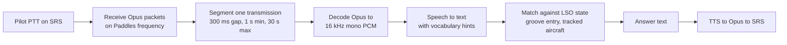
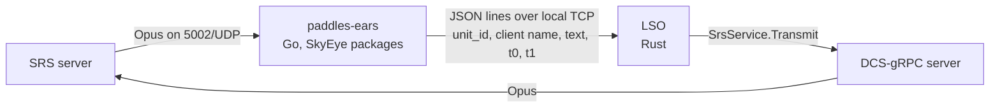
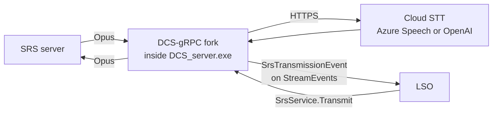

# Paddles voice loop: two implementation plans

Date: 2026-09-16. Companion to `LSO TTS Capabilities.md` (speaking only). This document covers the
full loop: the pilot speaks on SRS, the LSO understands a small set of calls, and answers on the
same frequency.

Reference implementations studied: SkyEye (dharmab, Go, MIT, v1.10.0 of 2026-07-10, local Whisper)
and OverlordBot (RurouniJones, C#, unmaintained since 2023, Azure LUIS retired 2026-03-31).

## What both solutions must do

Reading: the first four boxes are generic radio plumbing, copied from SkyEye. The last three use
what the LSO already knows. The only decision is where the plumbing runs: in a separate process
(Solution A) or inside the DCS-gRPC server fork (Solution B).

Calls in scope for the first version, all keyword matches, no grammar:

| Pilot says | LSO condition | LSO answers |
| --- | --- | --- |
| "... ball ..." | tracked aircraft has `entered_groove()` and no ball acknowledged yet | "Roger ball" (+ aircraft type, deck wind) |
| "... clara ..." | same | "Paddles contact, fly the ball" or a lineup call |
| "Paddles radio check" | any time | "Loud and clear" |
| nothing understood | groove entry passed, no ball call within 3 s | optional: "Call the ball" |

Digits, fuel state and callsign parsing are out of scope for the first version. They are the
part OverlordBot needed LUIS for and the part SkyEye solves with a hand-written grammar; both can
come later.

## Phase 0, shared by both solutions

Nothing in phase 0 depends on the A/B choice and all of it is needed anyway.

1. **Speak first.** Implement the grade readback and bolter call described in
   `LSO TTS Capabilities.md` through the fork's existing `SrsService.Transmit`. This validates
   the SRS server address, protocol version, voices, line of sight and the per-frequency call queue.
2. **Fix the lingering SRS client** in the fork's `src/rpc/srs.rs`: close the SRS connection when the
   transmit task finishes. Tag `v0.10.1`, bump the `tag =` pin in `Cargo.toml`.
3. **Ship the F10 fallback.** `MissionService.AddGroupCommand` "Paddles > Call the ball" and a
   `GroupCommandEvent` handler in the LSO that triggers the same "Roger ball" answer. This is the
   zero-recognition path and stays as the backup on a night with a bad microphone.
4. **Record real ball calls.** During phase 0 nights, ask two or three pilots to make ball calls on
   the Paddles frequency and keep the SRS server recording (SRS has a server-side recorder). Those
   clips become the test corpus for the recognizer, exactly as `tests/recordings/live_2026-09/`
   is for grading.

After phase 0 the LSO can already answer a ball call, triggered by F10 instead of voice.

## Solution A: separate "Paddles ears" process

A standalone Go process built from SkyEye's packages. It owns the SRS receive side and the
recognizer, and hands the LSO a transcript. The LSO keeps the decision logic and keeps speaking
through the fork's `Transmit`, so the only new thing on the radio is listening.

Reading: one arrow in each direction. The Go process never talks to DCS; the LSO never touches
audio.

### Components

| Component | Source | Work |
| --- | --- | --- |
| SRS client, receive, segmentation | SkyEye `pkg/simpleradio` (receive.go, voice.go, sync.go) | Reuse as a Go module dependency or vendor the package. Configure one radio on the Paddles frequency, coalition Blue, carrier position from a config value or from the LSO feed |
| Opus decode | SkyEye `pkg/simpleradio/voice`, hraban/opus | Reuse unchanged |
| Recognizer | SkyEye `pkg/recognizer` (whisper.go, openai.go, prompt.go) | Reuse. Replace the prompt with LSO vocabulary: "Paddles", "ball", "clara", "Hornet", "Tomcat", "Goshawk", "Harrier", plus the callsigns the LSO reports as being in the pattern |
| Output | new, ~150 lines | JSON lines on `127.0.0.1:<port>`: `{unit_id, client_name, frequency, text, started_at, ended_at, recognizer_ms}` |
| Optional input | new, ~100 lines | JSON lines from the LSO with the current callsign list and carrier position, to refresh the Whisper prompt and the SRS position |
| LSO side | new `src/tasks/voice_listener.rs`, ~300 lines | Connect to the ears socket with backoff, publish transcripts into the event hub as a local event, match keywords against the recorder's state, enqueue answers on the TTS queue from phase 0 |

SkyEye's `parser`, `controller`, `composer`, `radar` and `telemetry` packages are not needed: they
are the AWACS logic and the Tacview reader.

### Speaker identity

The SRS voice packet carries the transmitter's `client_sguid` and `unit_id`. SkyEye keys
transmissions by that GUID. The LSO tracks passes by DCS unit, so `unit_id` in the transcript is
enough to attach the call to the aircraft in the groove without recognising the callsign at all.
`GetClients` from the fork gives the mapping GUID to unit name if needed.

### Where it runs

Preferably not on the DCS server, but it can be, under the conditions in "Local recognition on
the DCS host" below. SkyEye's author states that local Whisper on the same machine as DCS is
unsupported and that shared-core VMs give stuttering audio. Options, from the SkyEye benchmark
table for the `small.en` model:

| Host | Recognition time | Note |
| --- | --- | --- |
| Desktop-class CPU (AMD 5900X) | 1.5 to 2 s | The machine that already runs the LSO, if it is not the DCS box |
| 4 dedicated cloud cores | 3 to 3.5 s | Acceptable for a ball call, late for anything else |
| OpenAI transcription API | network bound, ~1 s | No local CPU, needs a key, audio leaves the LAN |

### Steps

1. Fork SkyEye, strip to `simpleradio`, `recognizer`, `pcm`; add the JSON-lines output. Target: a
   binary that prints transcripts of everything said on one frequency. Two to three days.
2. Test against the phase 0 clips and a live SRS server. Measure end-to-end time from PTT release
   to transcript line. One night.
3. LSO `voice_listener` task with the keyword matcher and the ball-call state per pass. Two days.
4. Live night with the F10 path disabled. Compare recognition hit rate per pilot and per aircraft.
5. Only then: prompt tuning with the callsigns of the night, and a "Call the ball" prompt when no
   call is heard.

### Risks

- Two languages, two build chains (Go with CGO and whisper.cpp; Rust). The Go part is small but
  is a second thing to keep compatible with each SRS release.
- A second host or a second process on the LSO host. The LSO host must have AVX2 and about 3 GB of
  RAM free for local Whisper.
- Transcript transport is bespoke. Keep it to JSON lines so it can be replayed from a file in
  tests, the same way `lso file` replays JSON recordings.

## Solution B: receive path inside the DCS-gRPC fork

The fork already has an SRS client, an Opus encoder and a background SRS connection. Solution B
completes the receive side that upstream left as a stub, adds a speech-to-text provider next to
the TTS providers, and publishes transcripts as a new event on `StreamEvents`. The LSO consumes it
from the event hub it already runs.

Reading: everything audio stays in the fork. The LSO sees text events in and sends text out.

### Changes in the fork

| Area | File | Change |
| --- | --- | --- |
| Receive radio | `srs/src/stream.rs` `create_radio_update_message` | Populate `radios` with one `Radio { freq, modulation: Am, .. }` per configured listen frequency. Today the list is empty and the SRS server routes no audio to the client |
| Voice packet metadata | `srs/src/stream.rs` `Packet::Voice` | Carry `client_sguid`, `unit_id` and `frequencies` alongside `audio_part`, not only the audio bytes |
| Segmenter | new `srs/src/receive.rs` | Per `transmission_sguid`: append frames, end after 300 ms without packets, drop under 1 s, truncate at 30 s. Same constants as SkyEye |
| Opus decode | `tts/src/lib.rs` or new `stt` crate | `audiopus::coder::Decoder`, 16 kHz mono, 20 ms frames. The encoder already lives here |
| STT providers | new `stt` crate, ~400 lines | Trait `Recognizer`, three HTTP implementations: Azure Speech REST (key and region already in the config schema for TTS), OpenAI transcription API, and a local whisper.cpp server (`whisper-server`, OpenAI-compatible endpoint, any host on the LAN). No in-process inference: linking whisper.cpp into the DLL loaded by DCS is deliberately excluded, see "Local recognition on the DCS host" |
| Vocabulary hints | `stt` | Azure phrase list and OpenAI prompt with the LSO vocabulary. Callsigns can be refreshed by a small RPC or taken from the SRS client names |
| Event | `protos/dcs/mission/v0/mission.proto` | `SrsTransmissionEvent { unit, frequency, text, srs_client_name, started_at, duration_ms, recognizer }` next to `TtsEvent`. Also emitted with empty text when recognition fails, so the LSO can fall back to "say again" |
| Background listener | `src/srs.rs` `run` | Stop discarding `Packet::Voice`; feed the segmenter; on a closed transmission call the recognizer on a spawned task and emit the event |
| Config | `src/config.rs`, `lua/DCS-gRPC/grpc.lua`, README | `srs.listen.frequencies = { 250000000 }`, `stt.defaultProvider`, `stt.provider.azure.*`, `stt.provider.openai.key`, `stt.provider.whisper.url` |
| Lingering client fix | `src/rpc/srs.rs` | From phase 0 |
| Release | tags, `CHANGELOG.md` | `v0.11.0`; LSO bumps the stubs pin |

### Changes in the LSO

| File | Change |
| --- | --- |
| `src/client/srs_client.rs` | `transmit()` wrapper with its own timeout (from phase 0) |
| `src/tasks/event_hub.rs` | No change: the new event variant arrives through the existing stream |
| `src/tasks/voice.rs` (new) | Subscribe to the hub, filter `SrsTransmissionEvent` by the units currently in a recovery, keyword match, answer through the TTS queue |
| `src/tasks/record_recovery.rs` | Expose groove entry and touchdown to the voice task through a watch channel, so the matcher knows which unit is in the groove |

### CPU on the DCS box

Opus decode of one 16 kHz mono stream is well under one percent of a core. Every recognizer is
network I/O on the tokio runtime, including the local whisper server, which is a separate process.
The earlier telemetry-gap analysis found the DCS mission thread, not the gRPC threads, to be the
bottleneck under load; this design adds nothing to the mission thread.

### Steps

1. Receive path and segmenter in the `srs` crate with a unit test that replays a captured packet
   sequence. Two days.
2. `stt` crate with the Azure or OpenAI provider and a CLI test binary that transcribes a WAV from
   the phase 0 corpus. Two days.
3. Event, config, background listener wiring, README. One day. Tag `v0.11.0`.
4. LSO voice task and matcher, bump the pin. Two days.
5. Live night, same protocol as A.

### Risks

- The audio code runs in the DCS server process. A panic in the segmenter or a blocking call in
  the recognizer would take the whole gRPC server with it. Every new task must be `spawn`ed,
  bounded and shutdown-aware like `run_in_background` already is.
- Recognition is always a network hop. With a cloud provider the DCS server needs outbound HTTPS
  and a key. With the local whisper server there is one more process to operate, on the DCS host
  or on another machine, see the next section.
- Upstream drift. The receive path diverges the fork further from `DCS-gRPC/rust-server`.
  `SYNC_UPSTREAM.md` already documents living with that.

## Local recognition on the DCS host

Two different things hide behind "local Whisper on the server", and only one of them is a bad idea.

**Inside the DCS process (excluded).** Linking whisper.cpp into the DCS-gRPC DLL would put a
native C++ inference engine, a 500 MB to 1.5 GB model and a burst of multi-threaded compute inside
`DCS_server.exe`. A crash in the library takes the mission down with it, the model's memory is
charged to DCS, and the threads compete with the simulation with no way to give DCS priority
because they are the same process. This is why Solution B only talks to recognizers over HTTP.

**A separate process on the same machine (acceptable under conditions).** SkyEye's author calls
this "not intended" and unsupported, which is a support policy, not a physical limit. What
actually happens on CPU with the `small.en` model:

| Quantity | Value | Source |
| --- | --- | --- |
| Compute per ball call (2 to 3 s of audio) | 1.5 to 2 s on a desktop CPU, 3 to 3.5 s on 4 cloud cores, using every thread it is given at 100 % | SkyEye benchmark table |
| Model in RAM | about 1 GB for `small.en`, 1.5 GB for `medium.en` | whisper.cpp model sizes |
| How often | once per pass, at groove entry, the moment the recorder is busiest | LSO timing |
| GPU path | 0.1 to 0.5 s and almost no CPU, needs about 2 GB of VRAM; SkyEye has an experimental Vulkan build | SkyEye ADMIN.md |

The DCS dedicated server is dominated by one heavy simulation thread plus a few workers. On a box
with spare physical cores, a whisper server capped to two or three threads at "below normal"
Windows priority leaves the simulation thread alone: the scheduler always prefers DCS. On a
shared-core VM or a 4-core box already near its limit, the same burst lands on the simulation
thread and shows up as the one-second telemetry gaps the project has already chased.

Conditions to run it on the DCS host:

- At least three physical cores free at recovery time, measured, not assumed. Or a GPU.
- Thread cap and below-normal process priority on the whisper server.
- The LSO's telemetry health window as the acceptance test: run one night with the recognizer
  on and compare source-capture gaps and delivery age against a night without it. If the health
  goes orange during groove entries, move the process to another machine. Nothing else changes,
  because the fork only knows a URL.

So the honest statement is: local recognition is fine as a sidecar, anywhere on the LAN, and its
placement is decided by measurement. It is only excluded inside the DCS process.

## Comparison

| Criterion | A: separate Go process | B: inside the fork |
| --- | --- | --- |
| New code | ~550 lines Go glue + ~300 lines Rust | ~900 lines Rust + proto |
| Reuse | SkyEye packages as-is | Fork's SRS and Opus code, plus SkyEye's constants and design |
| Languages and build chains | Go with CGO and whisper.cpp, plus Rust | Rust only |
| Recognition | Local Whisper in-process, or cloud | Cloud, or a local whisper server over HTTP |
| Where CPU is spent | Wherever paddles-ears runs | Wherever the whisper server runs, or the cloud |
| Cloud dependency | Optional | Optional |
| Processes to operate | DCS, SRS, LSO, paddles-ears | DCS, SRS, LSO, plus whisper-server if local |
| Speaker identity | `unit_id` from SRS packet | Same, plus `GetUnitById` resolution in the fork |
| Latency, PTT release to answer | 2 to 3 s local desktop, 4 to 5 s small VM | 1.5 to 3 s, network bound |
| Failure isolation | Ears crash: LSO keeps grading, F10 still works | Recognizer bug can affect the gRPC server; needs care |
| Testability | Replay JSON-lines transcripts into the LSO | Replay packet captures in the srs crate; LSO replays events |
| Effort to first live night | About 6 days | About 7 days |

## Recommendation

Do phase 0 now regardless. Then Solution B, with the recognizer choice left to configuration:
a cloud key if one is acceptable, otherwise an off-the-shelf whisper.cpp server placed by
measurement. One language in the fork, everything behind the existing API key and event stream,
and the LSO change is a single new task. This is the better long-term shape for a project whose
fork is already its own.

Solution A keeps two uses. It is the right answer if the fork should stay close to upstream, and
it is a cheap one-night prototype: SkyEye's packages with a JSON-lines output show whether keyword
matching on ball calls is reliable enough before any fork code is written.

## Open questions

- [ ] Which SRS frequency is Paddles on the production missions, and is the SRS server enforcing
      line of sight, distance or coalition passwords?
- [ ] Is an Azure Speech or OpenAI key acceptable on the DCS server host?
- [ ] Does the LSO run on the DCS box or on another machine? This decides where A can run.
- [ ] Which pilots will record the phase 0 ball-call corpus, and on which aircraft?
- [ ] Should "Roger ball" include the deck wind, and from which reading: the report-time wind
      query or a groove-entry query?
